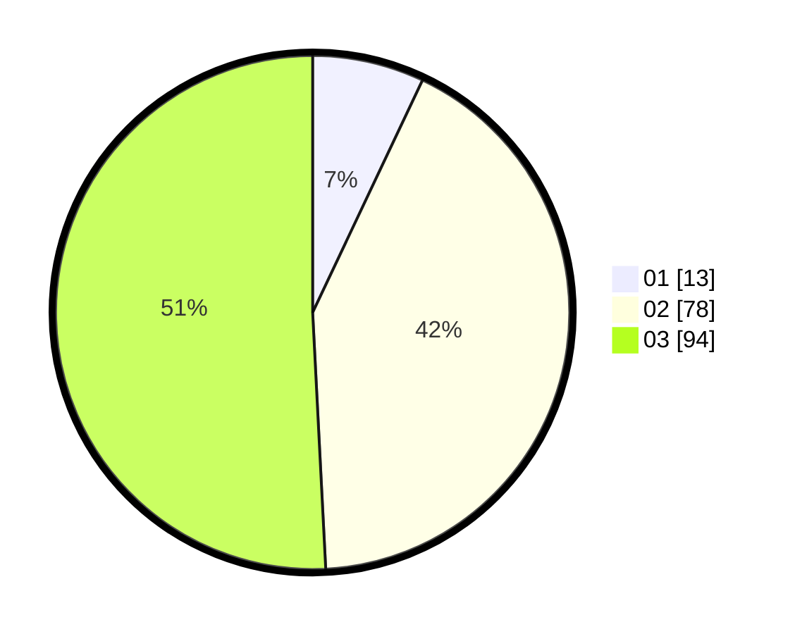

# Hasil

Hasil perolehan suara paslon dapat dilihat pada file paslon-01.txt, paslon-02.txt, dan paslon-03.txt.

Jika tidak ada, artinya data tersebut belum ada pada SIREKAP.

## Perolehan Suara

 * Paslon 01: **13**.
 * Paslon 02: **78**.
 * Paslon 03: **94**.

## Foto C Plano

https://sirekap-obj-formc.kpu.go.id/11a8/pemilu/ppwp/31/73/02/10/06/3173021006120-20240214-191617--1ea67086-430c-49e8-8ec0-20ec773afefd.jpg

https://sirekap-obj-formc.kpu.go.id/11a8/pemilu/ppwp/31/73/02/10/06/3173021006120-20240214-191704--deebec18-3a19-47f6-a853-d06b8d61ef8c.jpg

https://sirekap-obj-formc.kpu.go.id/11a8/pemilu/ppwp/31/73/02/10/06/3173021006120-20240214-191808--1bb00d2b-3c83-4d50-8bd5-1f431cdad734.jpg

## DATA PEMILIH TETAP

Jumlah pemilih dalam DPT: **266**.
 * L: **128**.
 * P: **138**.

## DATA PENGGUNA HAK PILIH

Jumlah pengguna hak pilih dalam DPT: **188**.
 * L: **88**.
 * P: **100**.

Jumlah pengguna hak pilih dalam DPTb: **0**.
 * L: **0**.
 * P: **0**.

Jumlah pengguna hak pilih dalam DPK: **1**.
 * L: **1**.
 * P: **0**.

Jumlah pengguna hak pilih: **189**.
 * L: **89**.
 * P: **100**.

## JUMLAH SUARA SAH DAN TIDAK SAH

JUMLAH SELURUH SUARA SAH: **185**.

JUMLAH SUARA TIDAK SAH: **4**.

JUMLAH SELURUH SUARA SAH DAN SUARA TIDAK SAH: **189**.
