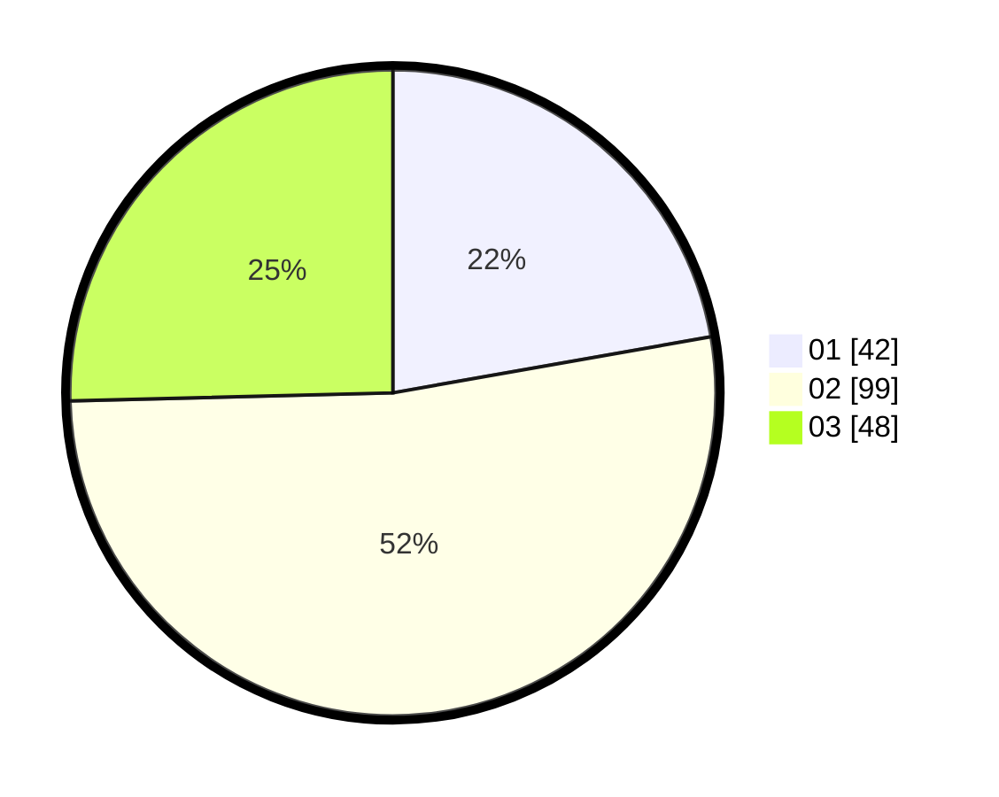

# Hasil

Hasil perolehan suara paslon dapat dilihat pada file paslon-01.txt, paslon-02.txt, dan paslon-03.txt.

Jika tidak ada, artinya data tersebut belum ada pada SIREKAP.

## Perolehan Suara

 * Paslon 01: **42**.
 * Paslon 02: **99**.
 * Paslon 03: **48**.

## Foto C Plano

https://sirekap-obj-formc.kpu.go.id/da73/pemilu/ppwp/31/73/02/10/06/3173021006123-20240214-190842--58544b80-ca41-4579-bcb6-656222db5f14.jpg

https://sirekap-obj-formc.kpu.go.id/da73/pemilu/ppwp/31/73/02/10/06/3173021006123-20240214-191045--8a47cc97-13a8-4326-9f99-f4129a2aa16b.jpg

https://sirekap-obj-formc.kpu.go.id/da73/pemilu/ppwp/31/73/02/10/06/3173021006123-20240214-191314--c7b0b42d-e011-4ef3-b757-74d8f974a94e.jpg

## DATA PEMILIH TETAP

Jumlah pemilih dalam DPT: **272**.
 * L: **133**.
 * P: **139**.

## DATA PENGGUNA HAK PILIH

Jumlah pengguna hak pilih dalam DPT: **186**.
 * L: **86**.
 * P: **100**.

Jumlah pengguna hak pilih dalam DPTb: **3**.
 * L: **2**.
 * P: **1**.

Jumlah pengguna hak pilih dalam DPK: **2**.
 * L: **1**.
 * P: **1**.

Jumlah pengguna hak pilih: **191**.
 * L: **89**.
 * P: **102**.

## JUMLAH SUARA SAH DAN TIDAK SAH

JUMLAH SELURUH SUARA SAH: **189**.

JUMLAH SUARA TIDAK SAH: **2**.

JUMLAH SELURUH SUARA SAH DAN SUARA TIDAK SAH: **191**.
