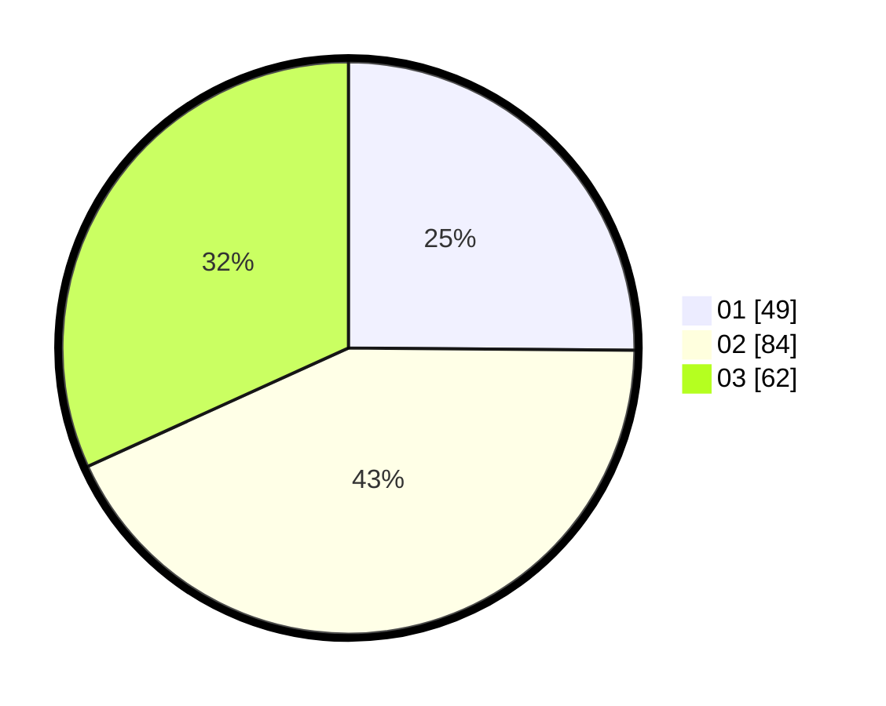

# Hasil

Hasil perolehan suara paslon dapat dilihat pada file paslon-01.txt, paslon-02.txt, dan paslon-03.txt.

Jika tidak ada, artinya data tersebut belum ada pada SIREKAP.

## Perolehan Suara

 * Paslon 01: **49**.
 * Paslon 02: **84**.
 * Paslon 03: **62**.

## Foto C Plano

https://sirekap-obj-formc.kpu.go.id/84ab/pemilu/ppwp/31/73/02/10/06/3173021006124-20240214-205856--b41b877a-7671-418d-8a90-eeceb374e3c3.jpg

https://sirekap-obj-formc.kpu.go.id/84ab/pemilu/ppwp/31/73/02/10/06/3173021006124-20240214-210416--0155465e-2e9e-4c3f-9858-7c5a00c0636e.jpg

https://sirekap-obj-formc.kpu.go.id/84ab/pemilu/ppwp/31/73/02/10/06/3173021006124-20240214-210709--3d790b38-b8f0-4cc9-9e20-17f8440f0ff8.jpg
