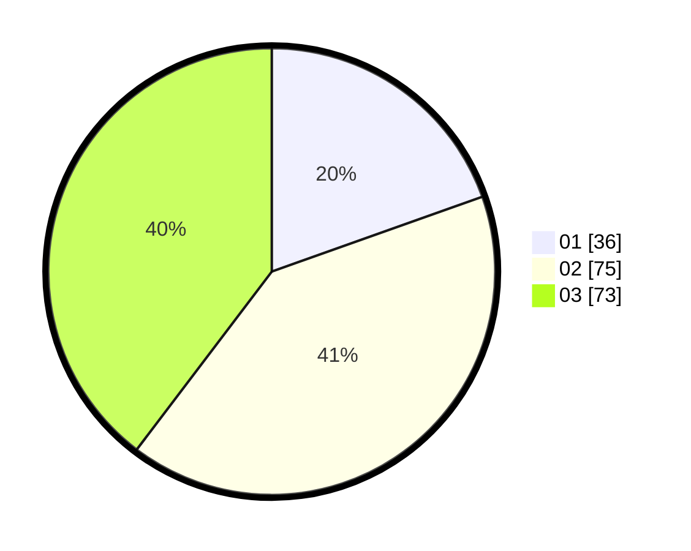

# Hasil

Hasil perolehan suara paslon dapat dilihat pada file paslon-01.txt, paslon-02.txt, dan paslon-03.txt.

Jika tidak ada, artinya data tersebut belum ada pada SIREKAP.

## Perolehan Suara

 * Paslon 01: **36**.
 * Paslon 02: **75**.
 * Paslon 03: **73**.

## Foto C Plano

https://sirekap-obj-formc.kpu.go.id/7d21/pemilu/ppwp/31/73/02/10/06/3173021006127-20240214-185309--590973d2-e628-4c65-8529-1b81d05bb9ec.jpg

https://sirekap-obj-formc.kpu.go.id/7d21/pemilu/ppwp/31/73/02/10/06/3173021006127-20240214-185609--5e74dbde-4a50-4a5c-94d0-7cee32739c9d.jpg

https://sirekap-obj-formc.kpu.go.id/7d21/pemilu/ppwp/31/73/02/10/06/3173021006127-20240214-185226--8f5787db-ecad-45c3-99b3-42b967e50a62.jpg

## DATA PEMILIH TETAP

Jumlah pemilih dalam DPT: **277**.
 * L: **141**.
 * P: **136**.

## DATA PENGGUNA HAK PILIH

Jumlah pengguna hak pilih dalam DPT: **183**.
 * L: **98**.
 * P: **85**.

Jumlah pengguna hak pilih dalam DPTb: **1**.
 * L: **0**.
 * P: **1**.

Jumlah pengguna hak pilih dalam DPK: **0**.
 * L: **0**.
 * P: **0**.

Jumlah pengguna hak pilih: **184**.
 * L: **98**.
 * P: **86**.

## JUMLAH SUARA SAH DAN TIDAK SAH

JUMLAH SELURUH SUARA SAH: **184**.

JUMLAH SUARA TIDAK SAH: **0**.

JUMLAH SELURUH SUARA SAH DAN SUARA TIDAK SAH: **184**.
