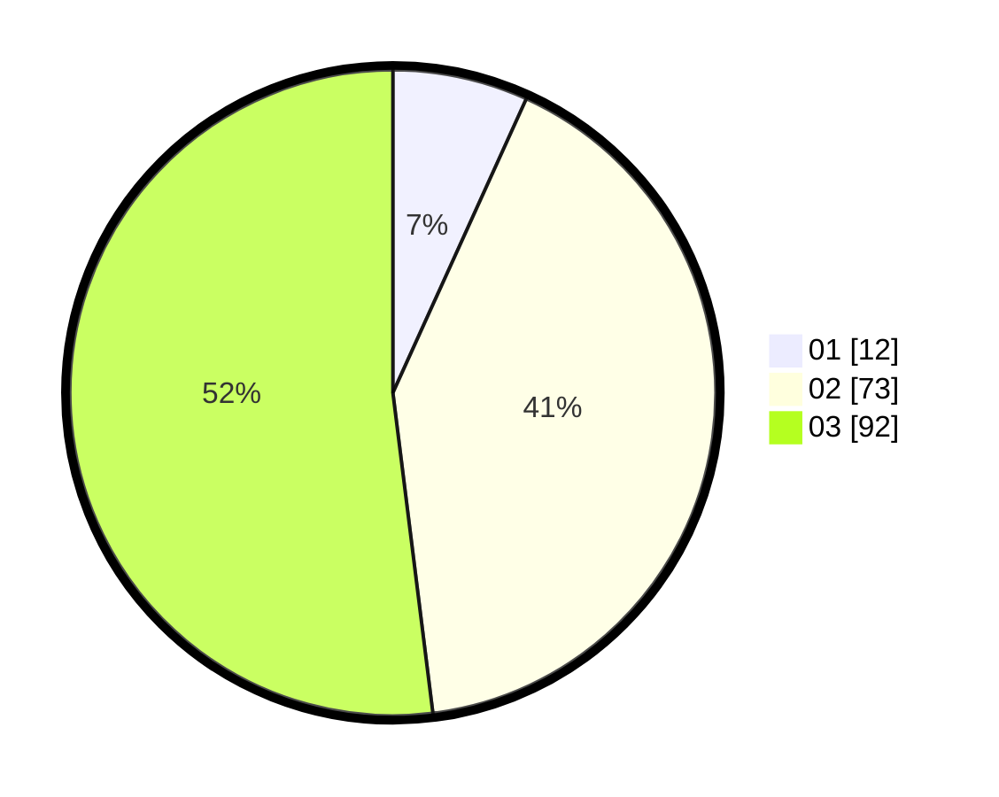

# Hasil

Hasil perolehan suara paslon dapat dilihat pada file paslon-01.txt, paslon-02.txt, dan paslon-03.txt.

Jika tidak ada, artinya data tersebut belum ada pada SIREKAP.

## Perolehan Suara

 * Paslon 01: **12**.
 * Paslon 02: **73**.
 * Paslon 03: **92**.

## Foto C Plano

https://sirekap-obj-formc.kpu.go.id/0fde/pemilu/ppwp/31/73/02/10/07/3173021007002-20240214-192437--d80834ed-7e11-4719-91f8-e6aab97e38fd.jpg

https://sirekap-obj-formc.kpu.go.id/0fde/pemilu/ppwp/31/73/02/10/07/3173021007002-20240214-192411--2c6e9074-a788-40fb-ad2e-f7f3dc99d42c.jpg
