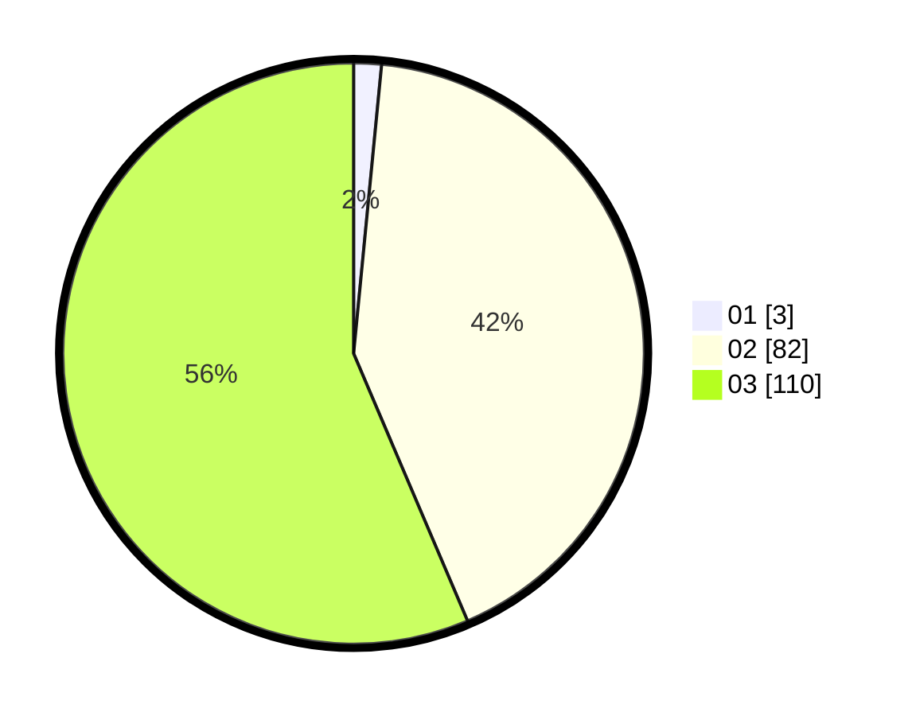

# Hasil

Hasil perolehan suara paslon dapat dilihat pada file paslon-01.txt, paslon-02.txt, dan paslon-03.txt.

Jika tidak ada, artinya data tersebut belum ada pada SIREKAP.

## Perolehan Suara

 * Paslon 01: **3**.
 * Paslon 02: **82**.
 * Paslon 03: **110**.

## Foto C Plano

https://sirekap-obj-formc.kpu.go.id/58be/pemilu/ppwp/31/73/02/10/07/3173021007003-20240215-170808--921975e3-3906-470e-bc72-773e25608270.jpg

https://sirekap-obj-formc.kpu.go.id/58be/pemilu/ppwp/31/73/02/10/07/3173021007003-20240215-170832--888db87a-4b6a-4a60-9a6c-6456d29b03d9.jpg

https://sirekap-obj-formc.kpu.go.id/58be/pemilu/ppwp/31/73/02/10/07/3173021007003-20240215-170818--944e41c1-2ded-48ed-9ccf-a974c01d2a33.jpg

## DATA PEMILIH TETAP

Jumlah pemilih dalam DPT: **260**.
 * L: **119**.
 * P: **141**.

## DATA PENGGUNA HAK PILIH

Jumlah pengguna hak pilih dalam DPT: **191**.
 * L: **85**.
 * P: **106**.

Jumlah pengguna hak pilih dalam DPTb: **1**.
 * L: **1**.
 * P: **0**.

Jumlah pengguna hak pilih dalam DPK: **6**.
 * L: **5**.
 * P: **1**.

Jumlah pengguna hak pilih: **198**.
 * L: **91**.
 * P: **107**.

## JUMLAH SUARA SAH DAN TIDAK SAH

JUMLAH SELURUH SUARA SAH: **195**.

JUMLAH SUARA TIDAK SAH: **3**.

JUMLAH SELURUH SUARA SAH DAN SUARA TIDAK SAH: **198**.
