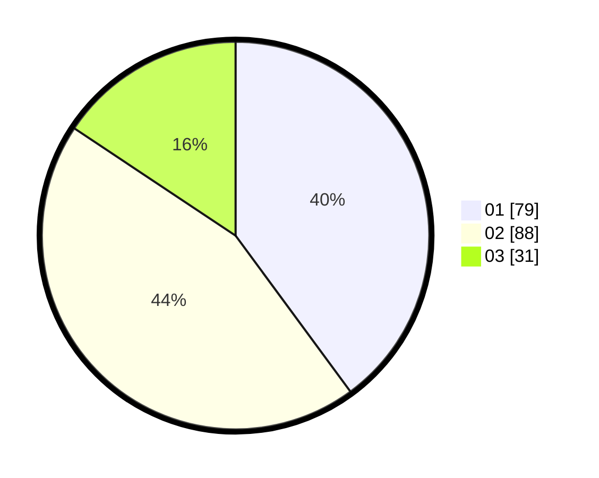

# Hasil

Hasil perolehan suara paslon dapat dilihat pada file paslon-01.txt, paslon-02.txt, dan paslon-03.txt.

Jika tidak ada, artinya data tersebut belum ada pada SIREKAP.

## Perolehan Suara

 * Paslon 01: **79**.
 * Paslon 02: **88**.
 * Paslon 03: **31**.

## Foto C Plano

https://sirekap-obj-formc.kpu.go.id/500f/pemilu/ppwp/31/73/02/10/07/3173021007005-20240216-013051--3f752d81-12cd-4140-a2c0-9fa0e2591a7e.jpg

https://sirekap-obj-formc.kpu.go.id/500f/pemilu/ppwp/31/73/02/10/07/3173021007005-20240216-013100--bc5d0353-37d3-450c-ae92-12331e437e9b.jpg

https://sirekap-obj-formc.kpu.go.id/500f/pemilu/ppwp/31/73/02/10/07/3173021007005-20240216-013055--b1f912a1-2292-415e-8f10-9f87987dd0fc.jpg

## DATA PEMILIH TETAP

Jumlah pemilih dalam DPT: **262**.
 * L: **133**.
 * P: **129**.

## DATA PENGGUNA HAK PILIH

Jumlah pengguna hak pilih dalam DPT: **189**.
 * L: **92**.
 * P: **97**.

Jumlah pengguna hak pilih dalam DPTb: **8**.
 * L: **4**.
 * P: **4**.

Jumlah pengguna hak pilih dalam DPK: **1**.
 * L: **0**.
 * P: **1**.

Jumlah pengguna hak pilih: **198**.
 * L: **96**.
 * P: **102**.

## JUMLAH SUARA SAH DAN TIDAK SAH

JUMLAH SELURUH SUARA SAH: **198**.

JUMLAH SUARA TIDAK SAH: **0**.

JUMLAH SELURUH SUARA SAH DAN SUARA TIDAK SAH: **198**.
