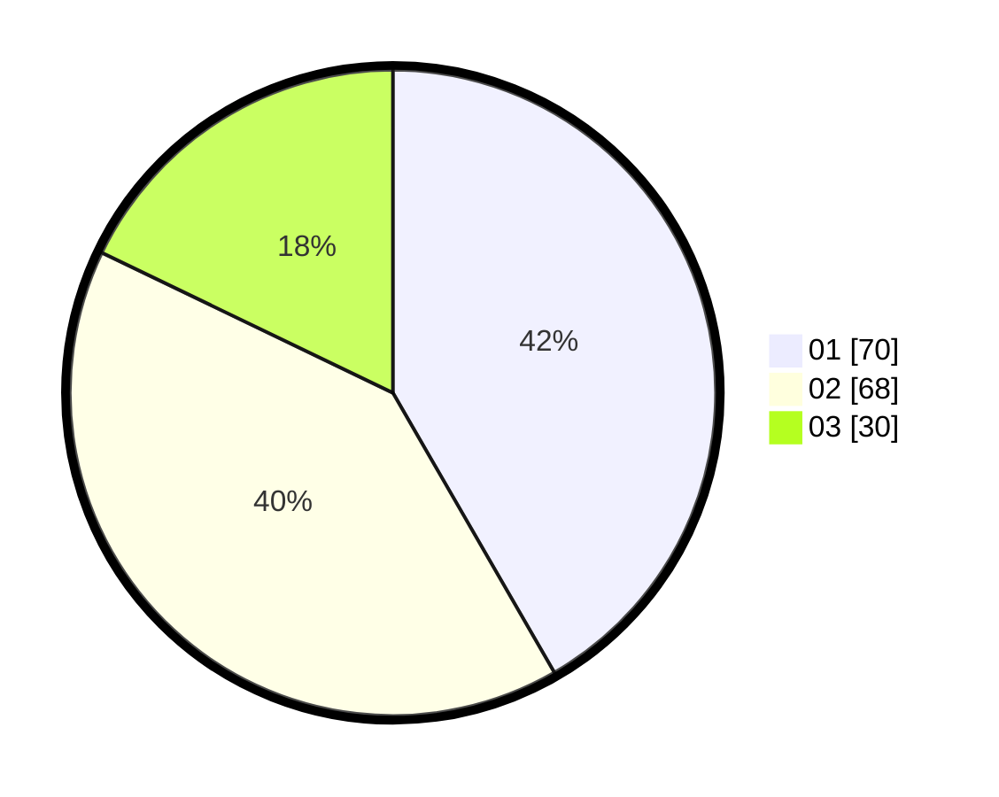

# Hasil

Hasil perolehan suara paslon dapat dilihat pada file paslon-01.txt, paslon-02.txt, dan paslon-03.txt.

Jika tidak ada, artinya data tersebut belum ada pada SIREKAP.

## Perolehan Suara

 * Paslon 01: **70**.
 * Paslon 02: **68**.
 * Paslon 03: **30**.

## Foto C Plano

https://sirekap-obj-formc.kpu.go.id/6408/pemilu/ppwp/31/73/02/10/07/3173021007006-20240214-193646--f9f0c610-3b06-41be-8093-af4eaf1b9b99.jpg

https://sirekap-obj-formc.kpu.go.id/6408/pemilu/ppwp/31/73/02/10/07/3173021007006-20240214-193740--b2f213d0-b95d-4a3d-a858-ca9b924be0e2.jpg

https://sirekap-obj-formc.kpu.go.id/6408/pemilu/ppwp/31/73/02/10/07/3173021007006-20240214-193833--d92353f8-9525-448b-b587-05df8b50a883.jpg

## DATA PEMILIH TETAP

Jumlah pemilih dalam DPT: **245**.
 * L: **127**.
 * P: **118**.

## DATA PENGGUNA HAK PILIH

Jumlah pengguna hak pilih dalam DPT: **168**.
 * L: **83**.
 * P: **85**.

Jumlah pengguna hak pilih dalam DPTb: **0**.
 * L: **0**.
 * P: **0**.

Jumlah pengguna hak pilih dalam DPK: **2**.
 * L: **0**.
 * P: **0**.

Jumlah pengguna hak pilih: **170**.
 * L: **85**.
 * P: **85**.

## JUMLAH SUARA SAH DAN TIDAK SAH

JUMLAH SELURUH SUARA SAH: **168**.

JUMLAH SUARA TIDAK SAH: **2**.

JUMLAH SELURUH SUARA SAH DAN SUARA TIDAK SAH: **170**.
