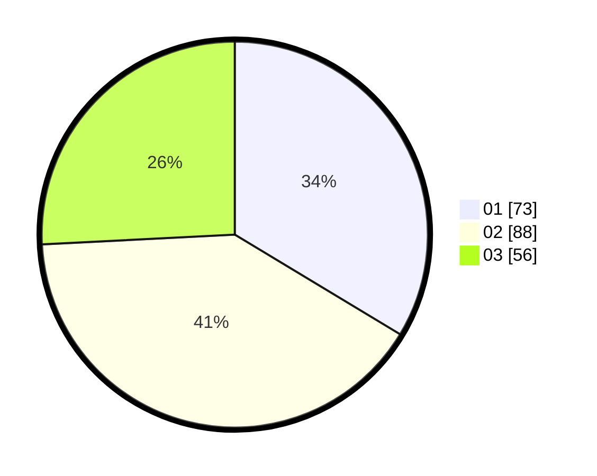

# Hasil

Hasil perolehan suara paslon dapat dilihat pada file paslon-01.txt, paslon-02.txt, dan paslon-03.txt.

Jika tidak ada, artinya data tersebut belum ada pada SIREKAP.

## Perolehan Suara

 * Paslon 01: **73**.
 * Paslon 02: **88**.
 * Paslon 03: **56**.

## Foto C Plano

https://sirekap-obj-formc.kpu.go.id/0b2e/pemilu/ppwp/31/73/02/10/07/3173021007012-20240216-142141--94d3fd93-4c89-4a69-9982-0551735bd2ac.jpg

https://sirekap-obj-formc.kpu.go.id/0b2e/pemilu/ppwp/31/73/02/10/07/3173021007012-20240214-235003--17a622e7-c140-4779-8f14-3339c5784909.jpg

https://sirekap-obj-formc.kpu.go.id/0b2e/pemilu/ppwp/31/73/02/10/07/3173021007012-20240214-235118--673f1206-588c-4edf-a807-0f6944178315.jpg

## DATA PEMILIH TETAP

Jumlah pemilih dalam DPT: **259**.
 * L: **126**.
 * P: **133**.

## DATA PENGGUNA HAK PILIH

Jumlah pengguna hak pilih dalam DPT: **217**.
 * L: **111**.
 * P: **106**.

Jumlah pengguna hak pilih dalam DPTb: **2**.
 * L: **0**.
 * P: **2**.

Jumlah pengguna hak pilih dalam DPK: **1**.
 * L: **1**.
 * P: **0**.

Jumlah pengguna hak pilih: **220**.
 * L: **112**.
 * P: **108**.

## JUMLAH SUARA SAH DAN TIDAK SAH

JUMLAH SELURUH SUARA SAH: **217**.

JUMLAH SUARA TIDAK SAH: **3**.

JUMLAH SELURUH SUARA SAH DAN SUARA TIDAK SAH: **220**.
