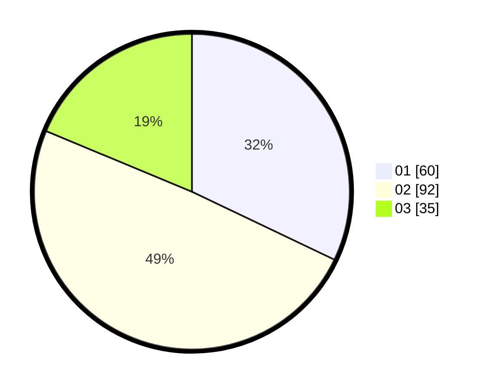

# Hasil

Hasil perolehan suara paslon dapat dilihat pada file paslon-01.txt, paslon-02.txt, dan paslon-03.txt.

Jika tidak ada, artinya data tersebut belum ada pada SIREKAP.

## Perolehan Suara

 * Paslon 01: **60**.
 * Paslon 02: **92**.
 * Paslon 03: **35**.

## Foto C Plano

https://sirekap-obj-formc.kpu.go.id/6105/pemilu/ppwp/31/73/02/10/07/3173021007013-20240215-022158--9c0baea0-cb2f-4c8e-841d-5ed1fbcbd791.jpg

https://sirekap-obj-formc.kpu.go.id/6105/pemilu/ppwp/31/73/02/10/07/3173021007013-20240215-022020--7d99a10d-6938-48a3-9b62-8ca7c45d74e6.jpg

https://sirekap-obj-formc.kpu.go.id/6105/pemilu/ppwp/31/73/02/10/07/3173021007013-20240215-021857--6aeacb98-650d-4755-8a9a-5f2be60077c2.jpg

## DATA PEMILIH TETAP

Jumlah pemilih dalam DPT: **279**.
 * L: **142**.
 * P: **137**.

## DATA PENGGUNA HAK PILIH

Jumlah pengguna hak pilih dalam DPT: **192**.
 * L: **94**.
 * P: **98**.

Jumlah pengguna hak pilih dalam DPTb: **4**.
 * L: **3**.
 * P: **1**.

Jumlah pengguna hak pilih dalam DPK: **0**.
 * L: **0**.
 * P: **0**.

Jumlah pengguna hak pilih: **196**.
 * L: **97**.
 * P: **99**.

## JUMLAH SUARA SAH DAN TIDAK SAH

JUMLAH SELURUH SUARA SAH: **187**.

JUMLAH SUARA TIDAK SAH: **9**.

JUMLAH SELURUH SUARA SAH DAN SUARA TIDAK SAH: **196**.
