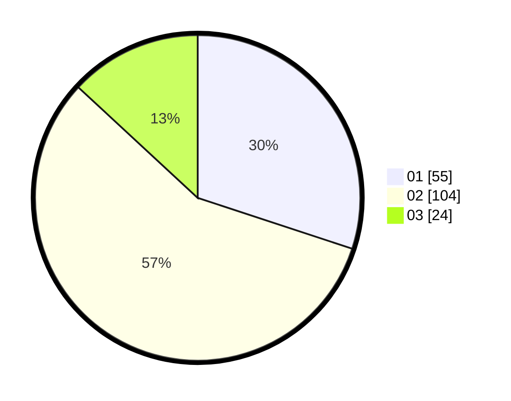

# Hasil

Hasil perolehan suara paslon dapat dilihat pada file paslon-01.txt, paslon-02.txt, dan paslon-03.txt.

Jika tidak ada, artinya data tersebut belum ada pada SIREKAP.

## Perolehan Suara

 * Paslon 01: **55**.
 * Paslon 02: **104**.
 * Paslon 03: **24**.

## Foto C Plano

https://sirekap-obj-formc.kpu.go.id/a206/pemilu/ppwp/31/73/02/10/07/3173021007016-20240215-162023--3ef773b8-b7e9-46e0-a4df-2d910d9cec74.jpg

https://sirekap-obj-formc.kpu.go.id/a206/pemilu/ppwp/31/73/02/10/07/3173021007016-20240214-155128--f3aeb744-aa7e-4206-b820-a7add0c865d2.jpg

https://sirekap-obj-formc.kpu.go.id/a206/pemilu/ppwp/31/73/02/10/07/3173021007016-20240214-155921--cc1738b2-c08d-46ee-8538-a565288b86f9.jpg

## DATA PEMILIH TETAP

Jumlah pemilih dalam DPT: **270**.
 * L: **136**.
 * P: **134**.

## DATA PENGGUNA HAK PILIH

Jumlah pengguna hak pilih dalam DPT: **182**.
 * L: **95**.
 * P: **87**.

Jumlah pengguna hak pilih dalam DPTb: **1**.
 * L: **1**.
 * P: **0**.

Jumlah pengguna hak pilih dalam DPK: **0**.
 * L: **0**.
 * P: **0**.

Jumlah pengguna hak pilih: **183**.
 * L: **96**.
 * P: **87**.

## JUMLAH SUARA SAH DAN TIDAK SAH

JUMLAH SELURUH SUARA SAH: **183**.

JUMLAH SUARA TIDAK SAH: **0**.

JUMLAH SELURUH SUARA SAH DAN SUARA TIDAK SAH: **183**.
