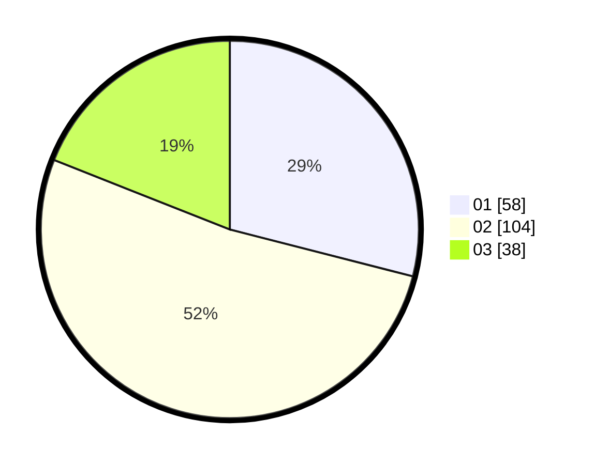

# Hasil

Hasil perolehan suara paslon dapat dilihat pada file paslon-01.txt, paslon-02.txt, dan paslon-03.txt.

Jika tidak ada, artinya data tersebut belum ada pada SIREKAP.

## Perolehan Suara

 * Paslon 01: **58**.
 * Paslon 02: **104**.
 * Paslon 03: **38**.

## Foto C Plano

https://sirekap-obj-formc.kpu.go.id/d1d7/pemilu/ppwp/31/73/02/10/07/3173021007020-20240217-060849--9e082e3e-deec-458e-9e17-8c5fbc7f72a6.jpg

https://sirekap-obj-formc.kpu.go.id/d1d7/pemilu/ppwp/31/73/02/10/07/3173021007020-20240217-060850--173f3321-5f7c-4f6c-8be0-4daebff29567.jpg

https://sirekap-obj-formc.kpu.go.id/d1d7/pemilu/ppwp/31/73/02/10/07/3173021007020-20240217-060849--14b9e8e6-3add-4ecb-a796-280d9378c628.jpg

## DATA PEMILIH TETAP

Jumlah pemilih dalam DPT: **270**.
 * L: **148**.
 * P: **122**.

## DATA PENGGUNA HAK PILIH

Jumlah pengguna hak pilih dalam DPT: **0**.
 * L: **0**.
 * P: **0**.

Jumlah pengguna hak pilih dalam DPTb: **0**.
 * L: **0**.
 * P: **0**.

Jumlah pengguna hak pilih dalam DPK: **0**.
 * L: **0**.
 * P: **0**.

Jumlah pengguna hak pilih: **0**.
 * L: **0**.
 * P: **0**.

## JUMLAH SUARA SAH DAN TIDAK SAH

JUMLAH SELURUH SUARA SAH: **200**.

JUMLAH SUARA TIDAK SAH: **1**.

JUMLAH SELURUH SUARA SAH DAN SUARA TIDAK SAH: **201**.
