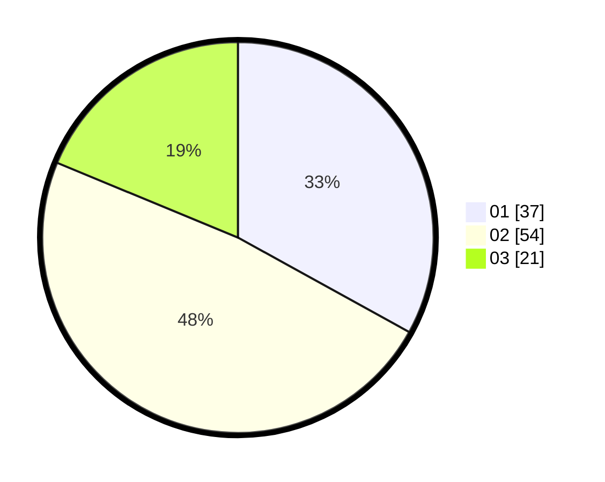

# Hasil

Hasil perolehan suara paslon dapat dilihat pada file paslon-01.txt, paslon-02.txt, dan paslon-03.txt.

Jika tidak ada, artinya data tersebut belum ada pada SIREKAP.

## Perolehan Suara

 * Paslon 01: **37**.
 * Paslon 02: **54**.
 * Paslon 03: **21**.

## Foto C Plano

https://sirekap-obj-formc.kpu.go.id/cf89/pemilu/ppwp/31/73/02/10/07/3173021007021-20240216-142340--f47c1fae-2d66-4985-afbb-5dc0583ad195.jpg

https://sirekap-obj-formc.kpu.go.id/cf89/pemilu/ppwp/31/73/02/10/07/3173021007021-20240216-142342--04d74811-a447-4326-9f1a-fb5121be6e1b.jpg

https://sirekap-obj-formc.kpu.go.id/cf89/pemilu/ppwp/31/73/02/10/07/3173021007021-20240216-142341--ba53c890-7bd6-4955-b43c-d7e16827fc89.jpg

## DATA PEMILIH TETAP

Jumlah pemilih dalam DPT: **273**.
 * L: **169**.
 * P: **104**.

## DATA PENGGUNA HAK PILIH

Jumlah pengguna hak pilih dalam DPT: **103**.
 * L: **57**.
 * P: **46**.

Jumlah pengguna hak pilih dalam DPTb: **19**.
 * L: **4**.
 * P: **15**.

Jumlah pengguna hak pilih dalam DPK: **0**.
 * L: **0**.
 * P: **0**.

Jumlah pengguna hak pilih: **122**.
 * L: **61**.
 * P: **61**.

## JUMLAH SUARA SAH DAN TIDAK SAH

JUMLAH SELURUH SUARA SAH: **112**.

JUMLAH SUARA TIDAK SAH: **10**.

JUMLAH SELURUH SUARA SAH DAN SUARA TIDAK SAH: **122**.
