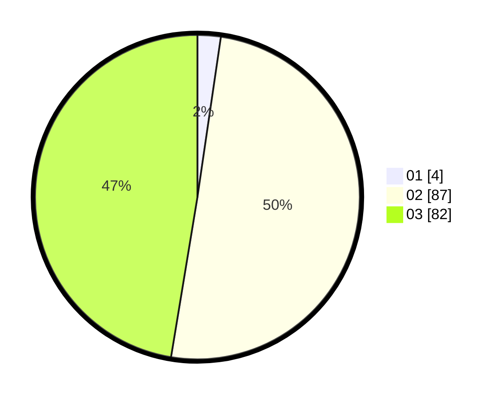

# Hasil

Hasil perolehan suara paslon dapat dilihat pada file paslon-01.txt, paslon-02.txt, dan paslon-03.txt.

Jika tidak ada, artinya data tersebut belum ada pada SIREKAP.

## Perolehan Suara

 * Paslon 01: **4**.
 * Paslon 02: **87**.
 * Paslon 03: **82**.

## Foto C Plano

https://sirekap-obj-formc.kpu.go.id/47b6/pemilu/ppwp/31/73/02/10/07/3173021007025-20240214-200836--4461f90a-e0c9-4ae5-9066-e9dc9223ff85.jpg

https://sirekap-obj-formc.kpu.go.id/47b6/pemilu/ppwp/31/73/02/10/07/3173021007025-20240214-201032--6af5b2c2-a90a-40ff-8110-97eb288dfb36.jpg
