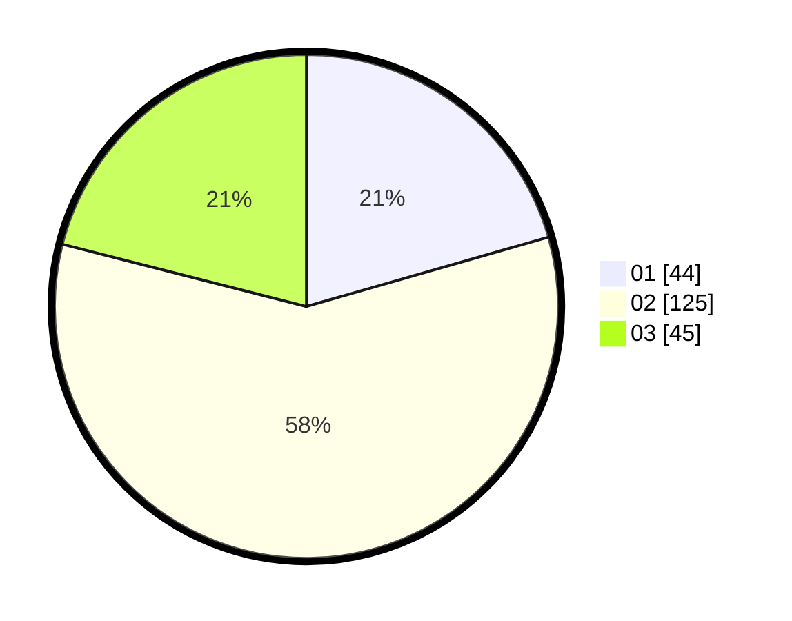

# Hasil

Hasil perolehan suara paslon dapat dilihat pada file paslon-01.txt, paslon-02.txt, dan paslon-03.txt.

Jika tidak ada, artinya data tersebut belum ada pada SIREKAP.

## Perolehan Suara

 * Paslon 01: **44**.
 * Paslon 02: **125**.
 * Paslon 03: **45**.

## Foto C Plano

https://sirekap-obj-formc.kpu.go.id/9cf7/pemilu/ppwp/31/73/02/10/07/3173021007028-20240214-225032--0e372214-c58d-4533-9e5a-9b56f5d6ed04.jpg

https://sirekap-obj-formc.kpu.go.id/9cf7/pemilu/ppwp/31/73/02/10/07/3173021007028-20240214-225128--63f2592b-e04d-4de1-8e91-5c598e3a3e6e.jpg

https://sirekap-obj-formc.kpu.go.id/9cf7/pemilu/ppwp/31/73/02/10/07/3173021007028-20240214-225221--52598f10-5def-43bc-9d19-15e7996cb315.jpg
