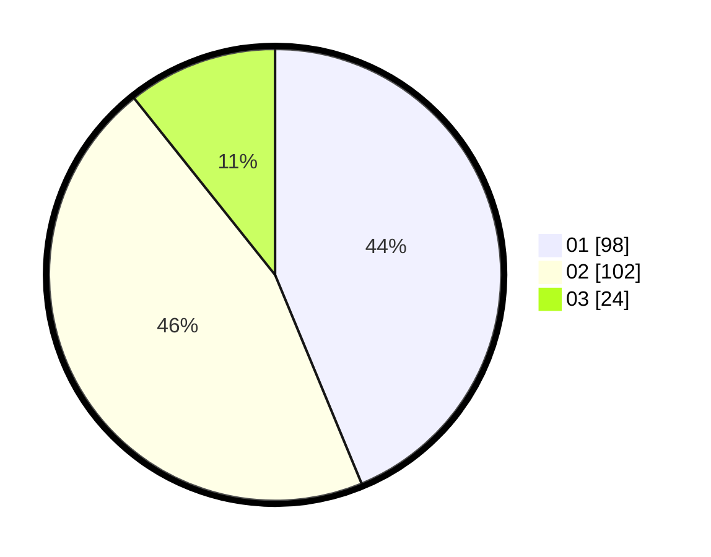

# Hasil

Hasil perolehan suara paslon dapat dilihat pada file paslon-01.txt, paslon-02.txt, dan paslon-03.txt.

Jika tidak ada, artinya data tersebut belum ada pada SIREKAP.

## Perolehan Suara

 * Paslon 01: **98**.
 * Paslon 02: **102**.
 * Paslon 03: **24**.

## Foto C Plano

https://sirekap-obj-formc.kpu.go.id/2721/pemilu/ppwp/31/73/02/10/07/3173021007030-20240214-211643--9caebb1b-71c7-499e-8282-920f88d5a651.jpg

https://sirekap-obj-formc.kpu.go.id/2721/pemilu/ppwp/31/73/02/10/07/3173021007030-20240217-014813--621b31ef-5f49-4e1b-9a8d-90d8e0716fb3.jpg

https://sirekap-obj-formc.kpu.go.id/2721/pemilu/ppwp/31/73/02/10/07/3173021007030-20240217-014817--e6ad0379-cef6-4813-a73d-625b223141b6.jpg

## DATA PEMILIH TETAP

Jumlah pemilih dalam DPT: **279**.
 * L: **142**.
 * P: **137**.

## DATA PENGGUNA HAK PILIH

Jumlah pengguna hak pilih dalam DPT: **227**.
 * L: **116**.
 * P: **111**.

Jumlah pengguna hak pilih dalam DPTb: **1**.
 * L: **1**.
 * P: **0**.

Jumlah pengguna hak pilih dalam DPK: **0**.
 * L: **0**.
 * P: **0**.

Jumlah pengguna hak pilih: **228**.
 * L: **117**.
 * P: **111**.

## JUMLAH SUARA SAH DAN TIDAK SAH

JUMLAH SELURUH SUARA SAH: **224**.

JUMLAH SUARA TIDAK SAH: **4**.

JUMLAH SELURUH SUARA SAH DAN SUARA TIDAK SAH: **228**.
