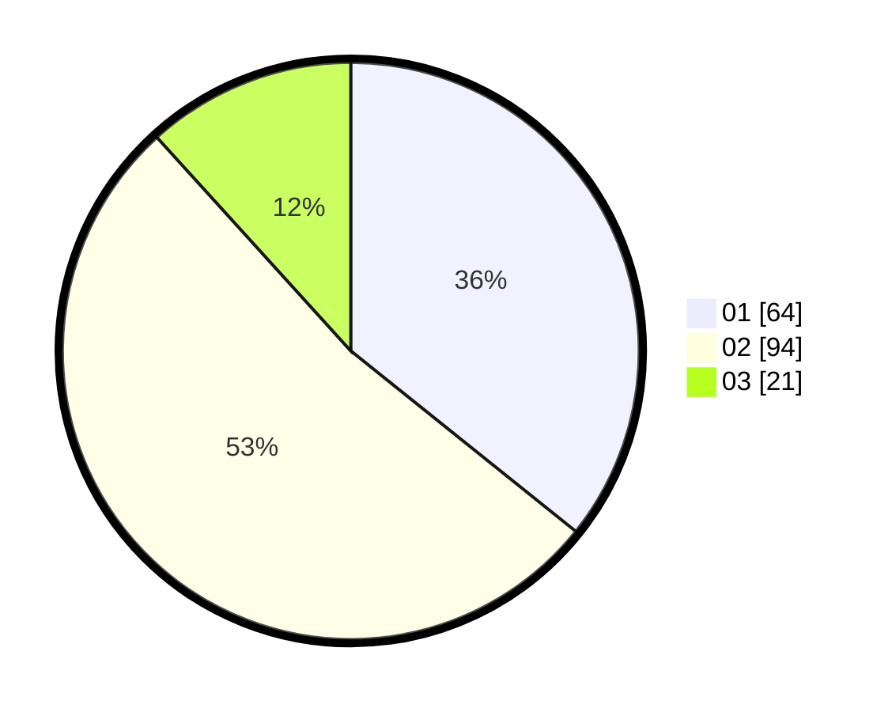

# Hasil

Hasil perolehan suara paslon dapat dilihat pada file paslon-01.txt, paslon-02.txt, dan paslon-03.txt.

Jika tidak ada, artinya data tersebut belum ada pada SIREKAP.

## Perolehan Suara

 * Paslon 01: **64**.
 * Paslon 02: **94**.
 * Paslon 03: **21**.

## Foto C Plano

https://sirekap-obj-formc.kpu.go.id/2b33/pemilu/ppwp/31/73/02/10/07/3173021007041-20240218-134813--1e60accb-7246-4417-86ee-03b328c30799.jpg

https://sirekap-obj-formc.kpu.go.id/2b33/pemilu/ppwp/31/73/02/10/07/3173021007041-20240218-134815--5e71d8fa-6f72-4b81-b113-b49ce8136050.jpg

https://sirekap-obj-formc.kpu.go.id/2b33/pemilu/ppwp/31/73/02/10/07/3173021007041-20240218-134814--0192041b-673a-4f2b-831c-759984db8252.jpg

## DATA PEMILIH TETAP

Jumlah pemilih dalam DPT: **251**.
 * L: **126**.
 * P: **125**.

## DATA PENGGUNA HAK PILIH

Jumlah pengguna hak pilih dalam DPT: **180**.
 * L: **88**.
 * P: **92**.

Jumlah pengguna hak pilih dalam DPTb: **1**.
 * L: **1**.
 * P: **0**.

Jumlah pengguna hak pilih dalam DPK: **5**.
 * L: **3**.
 * P: **2**.

Jumlah pengguna hak pilih: **186**.
 * L: **92**.
 * P: **94**.

## JUMLAH SUARA SAH DAN TIDAK SAH

JUMLAH SELURUH SUARA SAH: **179**.

JUMLAH SUARA TIDAK SAH: **7**.

JUMLAH SELURUH SUARA SAH DAN SUARA TIDAK SAH: **186**.
