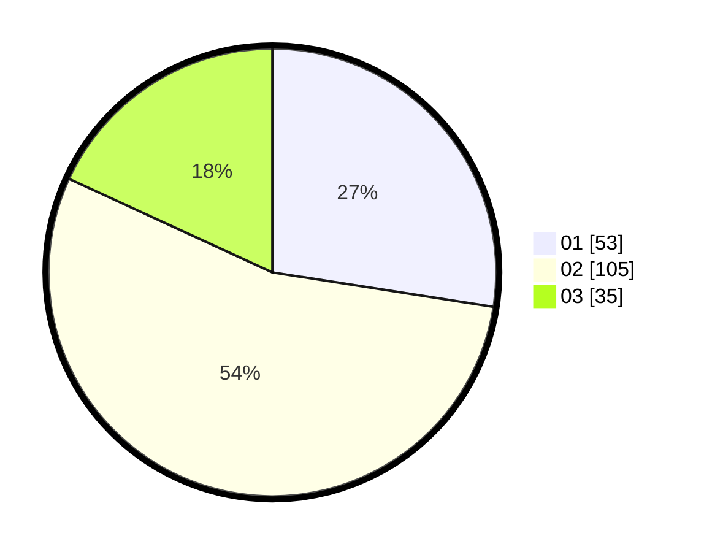

# Hasil

Hasil perolehan suara paslon dapat dilihat pada file paslon-01.txt, paslon-02.txt, dan paslon-03.txt.

Jika tidak ada, artinya data tersebut belum ada pada SIREKAP.

## Perolehan Suara

 * Paslon 01: **53**.
 * Paslon 02: **105**.
 * Paslon 03: **35**.

## Foto C Plano

https://sirekap-obj-formc.kpu.go.id/99a4/pemilu/ppwp/31/73/02/10/07/3173021007042-20240216-060648--233f9c49-454b-4f66-badb-af37f4975483.jpg

https://sirekap-obj-formc.kpu.go.id/99a4/pemilu/ppwp/31/73/02/10/07/3173021007042-20240216-060650--8e599592-819c-464a-bebe-c228c3a6fe6b.jpg

https://sirekap-obj-formc.kpu.go.id/99a4/pemilu/ppwp/31/73/02/10/07/3173021007042-20240216-060649--bd8cc5b8-48ba-4841-b5bc-b2ba9e8ffcc1.jpg

## DATA PEMILIH TETAP

Jumlah pemilih dalam DPT: **245**.
 * L: **121**.
 * P: **124**.

## DATA PENGGUNA HAK PILIH

Jumlah pengguna hak pilih dalam DPT: **181**.
 * L: **88**.
 * P: **93**.

Jumlah pengguna hak pilih dalam DPTb: **14**.
 * L: **10**.
 * P: **4**.

Jumlah pengguna hak pilih dalam DPK: **3**.
 * L: **1**.
 * P: **2**.

Jumlah pengguna hak pilih: **198**.
 * L: **99**.
 * P: **99**.

## JUMLAH SUARA SAH DAN TIDAK SAH

JUMLAH SELURUH SUARA SAH: **193**.

JUMLAH SUARA TIDAK SAH: **5**.

JUMLAH SELURUH SUARA SAH DAN SUARA TIDAK SAH: **198**.
