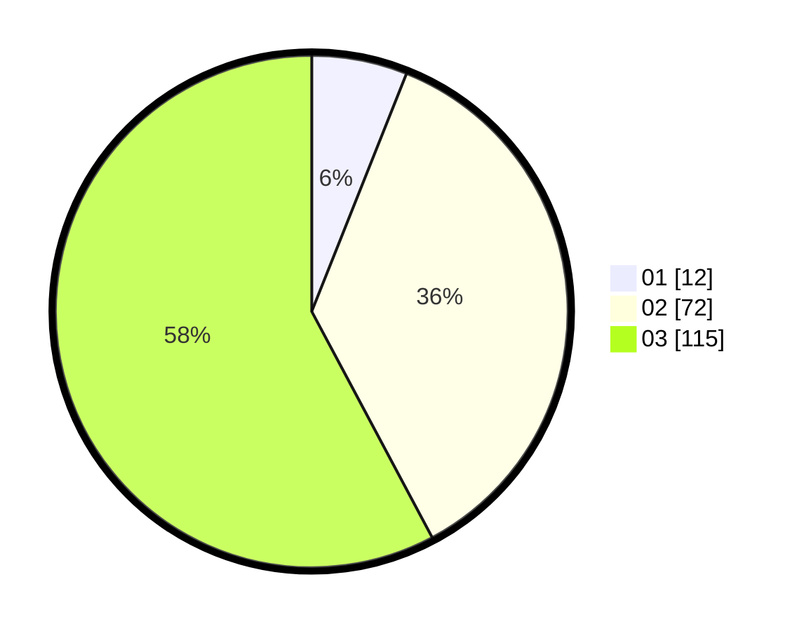

# Hasil

Hasil perolehan suara paslon dapat dilihat pada file paslon-01.txt, paslon-02.txt, dan paslon-03.txt.

Jika tidak ada, artinya data tersebut belum ada pada SIREKAP.

## Perolehan Suara

 * Paslon 01: **12**.
 * Paslon 02: **72**.
 * Paslon 03: **115**.

## Foto C Plano

https://sirekap-obj-formc.kpu.go.id/bef8/pemilu/ppwp/31/73/02/10/07/3173021007044-20240214-233151--f60eabd5-66d3-4495-9cff-e429d9971c47.jpg

https://sirekap-obj-formc.kpu.go.id/bef8/pemilu/ppwp/31/73/02/10/07/3173021007044-20240214-233256--317f7936-ac86-4536-aad0-e871eac5dde3.jpg

https://sirekap-obj-formc.kpu.go.id/bef8/pemilu/ppwp/31/73/02/10/07/3173021007044-20240214-233329--9340a423-91e4-4489-bd97-3009d65b4aae.jpg
