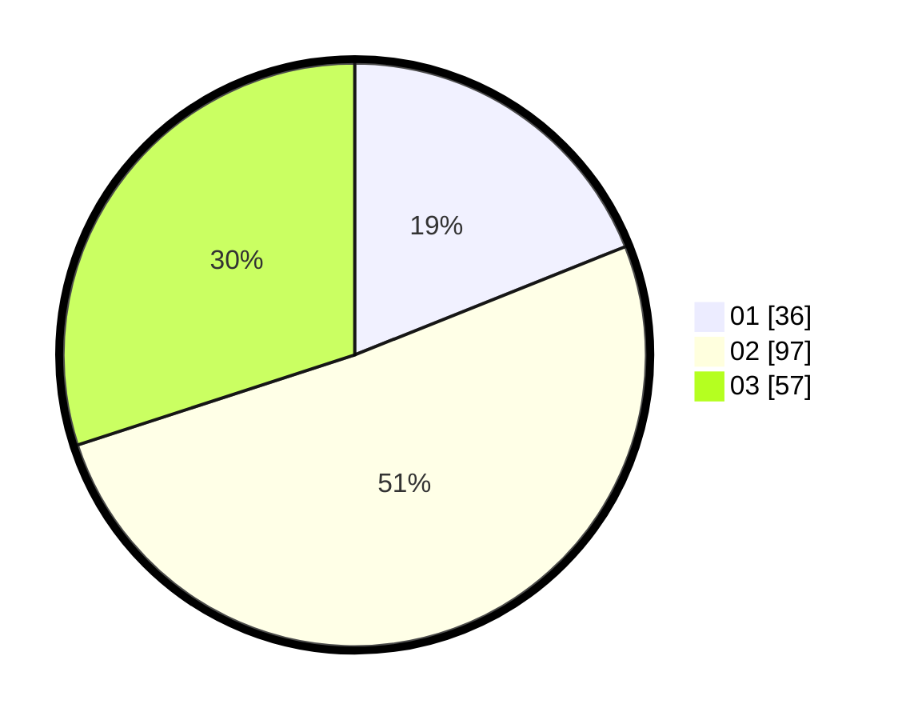

# Hasil

Hasil perolehan suara paslon dapat dilihat pada file paslon-01.txt, paslon-02.txt, dan paslon-03.txt.

Jika tidak ada, artinya data tersebut belum ada pada SIREKAP.

## Perolehan Suara

 * Paslon 01: **36**.
 * Paslon 02: **97**.
 * Paslon 03: **57**.

## Foto C Plano

https://sirekap-obj-formc.kpu.go.id/9f82/pemilu/ppwp/31/73/02/10/07/3173021007045-20240214-155508--077d5640-c091-43a8-80fe-ab55110cf8e4.jpg

https://sirekap-obj-formc.kpu.go.id/9f82/pemilu/ppwp/31/73/02/10/07/3173021007045-20240215-034419--a929a0cf-808c-4427-b2f7-467beb213774.jpg

https://sirekap-obj-formc.kpu.go.id/9f82/pemilu/ppwp/31/73/02/10/07/3173021007045-20240214-155638--5d85e3f6-c1ba-471f-ae6c-e82cdb55eb87.jpg

## DATA PEMILIH TETAP

Jumlah pemilih dalam DPT: **278**.
 * L: **126**.
 * P: **152**.

## DATA PENGGUNA HAK PILIH

Jumlah pengguna hak pilih dalam DPT: **188**.
 * L: **87**.
 * P: **101**.

Jumlah pengguna hak pilih dalam DPTb: **1**.
 * L: **0**.
 * P: **1**.

Jumlah pengguna hak pilih dalam DPK: **4**.
 * L: **3**.
 * P: **1**.

Jumlah pengguna hak pilih: **193**.
 * L: **90**.
 * P: **103**.

## JUMLAH SUARA SAH DAN TIDAK SAH

JUMLAH SELURUH SUARA SAH: **190**.

JUMLAH SUARA TIDAK SAH: **3**.

JUMLAH SELURUH SUARA SAH DAN SUARA TIDAK SAH: **193**.
