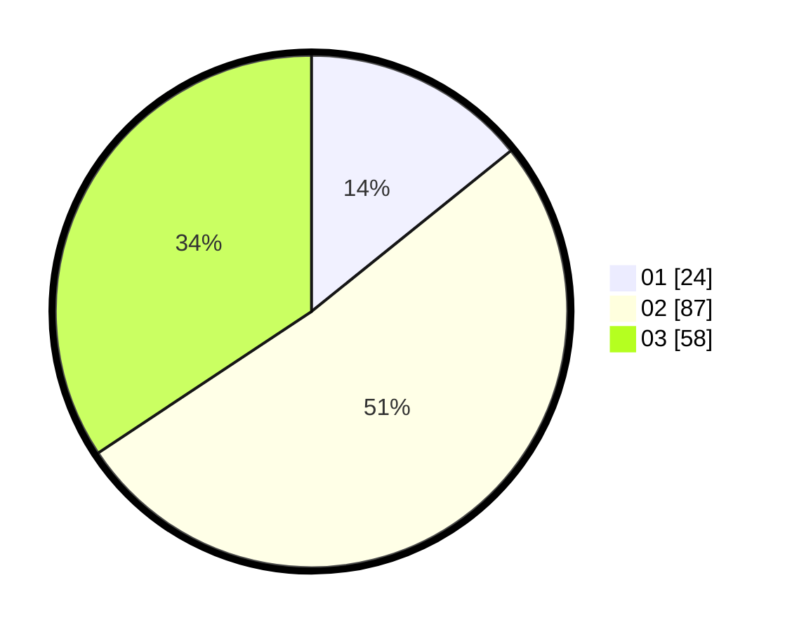

# Hasil

Hasil perolehan suara paslon dapat dilihat pada file paslon-01.txt, paslon-02.txt, dan paslon-03.txt.

Jika tidak ada, artinya data tersebut belum ada pada SIREKAP.

## Perolehan Suara

 * Paslon 01: **24**.
 * Paslon 02: **87**.
 * Paslon 03: **58**.

## Foto C Plano

https://sirekap-obj-formc.kpu.go.id/6972/pemilu/ppwp/31/73/02/10/07/3173021007047-20240214-193241--d3779351-4fed-46e6-b73f-81be5d2e0c06.jpg

https://sirekap-obj-formc.kpu.go.id/6972/pemilu/ppwp/31/73/02/10/07/3173021007047-20240214-193245--cfad2757-cca0-468d-9a76-f874c364ee52.jpg

https://sirekap-obj-formc.kpu.go.id/6972/pemilu/ppwp/31/73/02/10/07/3173021007047-20240214-195103--fad47f26-030d-48ae-9cca-6f197d3ebad5.jpg

## DATA PEMILIH TETAP

Jumlah pemilih dalam DPT: **281**.
 * L: **149**.
 * P: **132**.

## DATA PENGGUNA HAK PILIH

Jumlah pengguna hak pilih dalam DPT: **156**.
 * L: **80**.
 * P: **76**.

Jumlah pengguna hak pilih dalam DPTb: **14**.
 * L: **8**.
 * P: **6**.

Jumlah pengguna hak pilih dalam DPK: **2**.
 * L: **1**.
 * P: **1**.

Jumlah pengguna hak pilih: **172**.
 * L: **89**.
 * P: **83**.

## JUMLAH SUARA SAH DAN TIDAK SAH

JUMLAH SELURUH SUARA SAH: **169**.

JUMLAH SUARA TIDAK SAH: **3**.

JUMLAH SELURUH SUARA SAH DAN SUARA TIDAK SAH: **172**.
