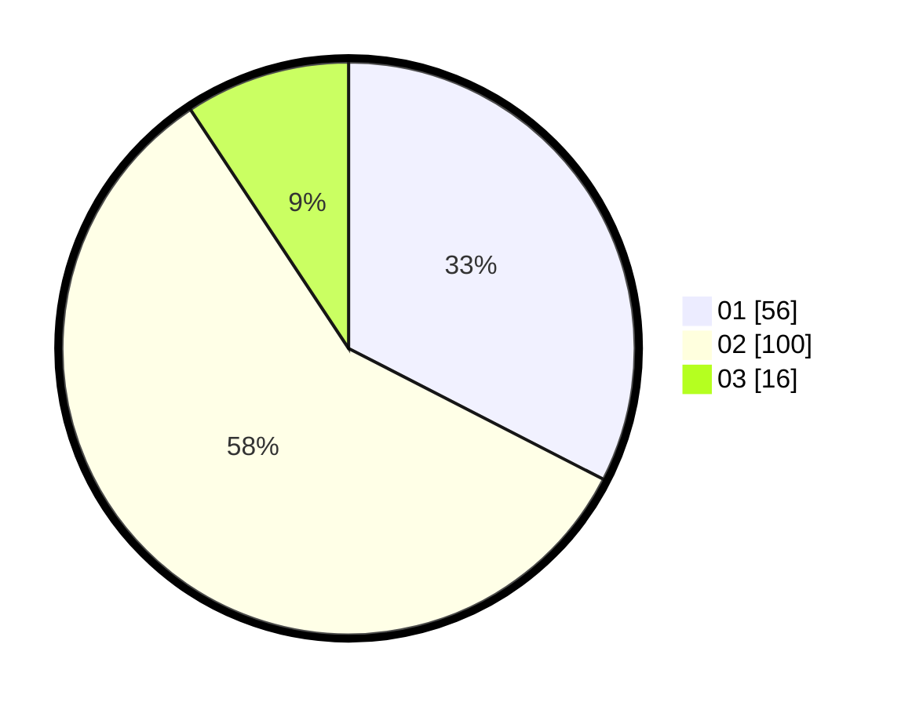

# Hasil

Hasil perolehan suara paslon dapat dilihat pada file paslon-01.txt, paslon-02.txt, dan paslon-03.txt.

Jika tidak ada, artinya data tersebut belum ada pada SIREKAP.

## Perolehan Suara

 * Paslon 01: **56**.
 * Paslon 02: **100**.
 * Paslon 03: **16**.

## Foto C Plano

https://sirekap-obj-formc.kpu.go.id/2f81/pemilu/ppwp/31/73/02/10/07/3173021007051-20240215-020232--63962ffa-e0ad-4d1d-9a9f-ca657efbb13a.jpg

https://sirekap-obj-formc.kpu.go.id/2f81/pemilu/ppwp/31/73/02/10/07/3173021007051-20240215-020333--acee249b-9ce5-41bb-8564-b47403a20898.jpg

https://sirekap-obj-formc.kpu.go.id/2f81/pemilu/ppwp/31/73/02/10/07/3173021007051-20240215-020418--c65e78d2-c50e-49a5-b9ae-3b0f8c9b9175.jpg
