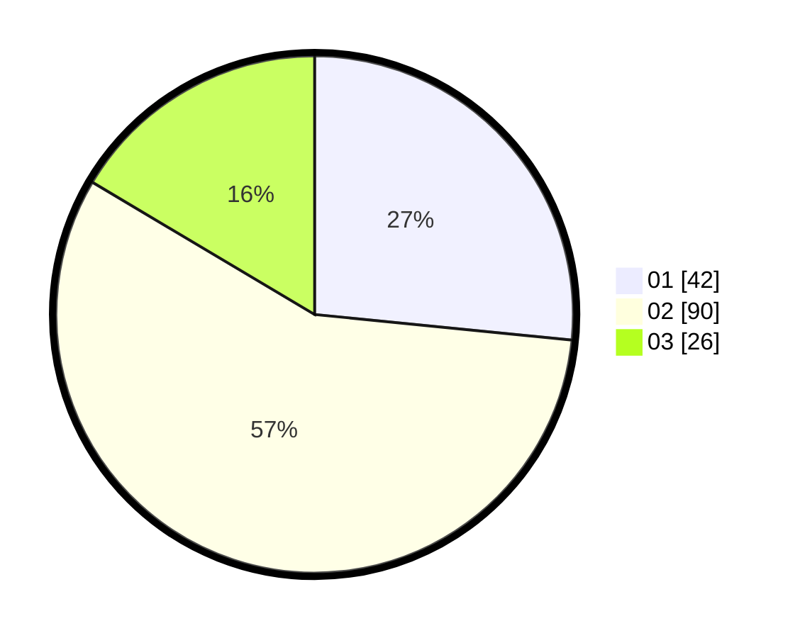

# Hasil

Hasil perolehan suara paslon dapat dilihat pada file paslon-01.txt, paslon-02.txt, dan paslon-03.txt.

Jika tidak ada, artinya data tersebut belum ada pada SIREKAP.

## Perolehan Suara

 * Paslon 01: **42**.
 * Paslon 02: **90**.
 * Paslon 03: **26**.

## Foto C Plano

https://sirekap-obj-formc.kpu.go.id/26eb/pemilu/ppwp/31/73/02/10/07/3173021007054-20240214-221148--b38c3da4-fb53-4c30-87a0-3a31f142fbe3.jpg

https://sirekap-obj-formc.kpu.go.id/26eb/pemilu/ppwp/31/73/02/10/07/3173021007054-20240214-221514--f09bc7be-5f92-4507-8bcf-76def841a160.jpg

https://sirekap-obj-formc.kpu.go.id/26eb/pemilu/ppwp/31/73/02/10/07/3173021007054-20240214-221633--65a72a3e-480a-46f5-9a44-e1bfd11764e9.jpg
