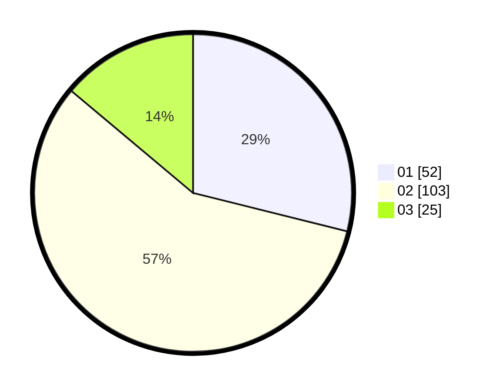

# Hasil

Hasil perolehan suara paslon dapat dilihat pada file paslon-01.txt, paslon-02.txt, dan paslon-03.txt.

Jika tidak ada, artinya data tersebut belum ada pada SIREKAP.

## Perolehan Suara

 * Paslon 01: **52**.
 * Paslon 02: **103**.
 * Paslon 03: **25**.

## Foto C Plano

https://sirekap-obj-formc.kpu.go.id/42cf/pemilu/ppwp/31/73/02/10/07/3173021007060-20240218-222619--af3a0061-3fff-4919-bd15-1a27444da4d4.jpg

https://sirekap-obj-formc.kpu.go.id/42cf/pemilu/ppwp/31/73/02/10/07/3173021007060-20240218-222629--f48eb94b-d9fe-4cd8-a3a3-bf9e8f3b6dfd.jpg

https://sirekap-obj-formc.kpu.go.id/42cf/pemilu/ppwp/31/73/02/10/07/3173021007060-20240218-222635--a6e4e81a-438a-4245-a05b-340b9d5d2636.jpg
