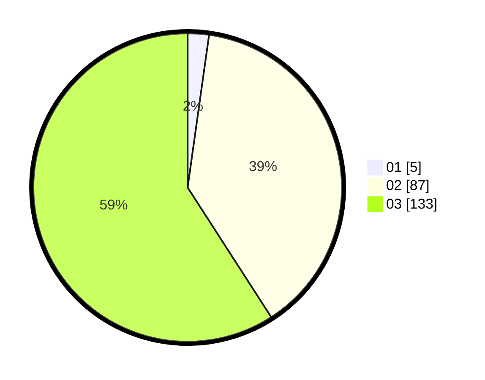

# Hasil

Hasil perolehan suara paslon dapat dilihat pada file paslon-01.txt, paslon-02.txt, dan paslon-03.txt.

Jika tidak ada, artinya data tersebut belum ada pada SIREKAP.

## Perolehan Suara

 * Paslon 01: **5**.
 * Paslon 02: **87**.
 * Paslon 03: **133**.

## Foto C Plano

https://sirekap-obj-formc.kpu.go.id/d626/pemilu/ppwp/31/73/02/10/07/3173021007062-20240214-201958--996b460b-40d6-453e-ab3c-ad0bf39c4374.jpg

https://sirekap-obj-formc.kpu.go.id/d626/pemilu/ppwp/31/73/02/10/07/3173021007062-20240214-194306--43153f60-dbe8-4eac-8264-b079037329d2.jpg

https://sirekap-obj-formc.kpu.go.id/d626/pemilu/ppwp/31/73/02/10/07/3173021007062-20240214-202134--4ef5eeb0-2204-4b28-bc93-8a292fc44e00.jpg

## DATA PEMILIH TETAP

Jumlah pemilih dalam DPT: **293**.
 * L: **145**.
 * P: **148**.

## DATA PENGGUNA HAK PILIH

Jumlah pengguna hak pilih dalam DPT: **203**.
 * L: **100**.
 * P: **103**.

Jumlah pengguna hak pilih dalam DPTb: **18**.
 * L: **9**.
 * P: **9**.

Jumlah pengguna hak pilih dalam DPK: **9**.
 * L: **6**.
 * P: **3**.

Jumlah pengguna hak pilih: **230**.
 * L: **115**.
 * P: **115**.

## JUMLAH SUARA SAH DAN TIDAK SAH

JUMLAH SELURUH SUARA SAH: **225**.

JUMLAH SUARA TIDAK SAH: **5**.

JUMLAH SELURUH SUARA SAH DAN SUARA TIDAK SAH: **230**.
