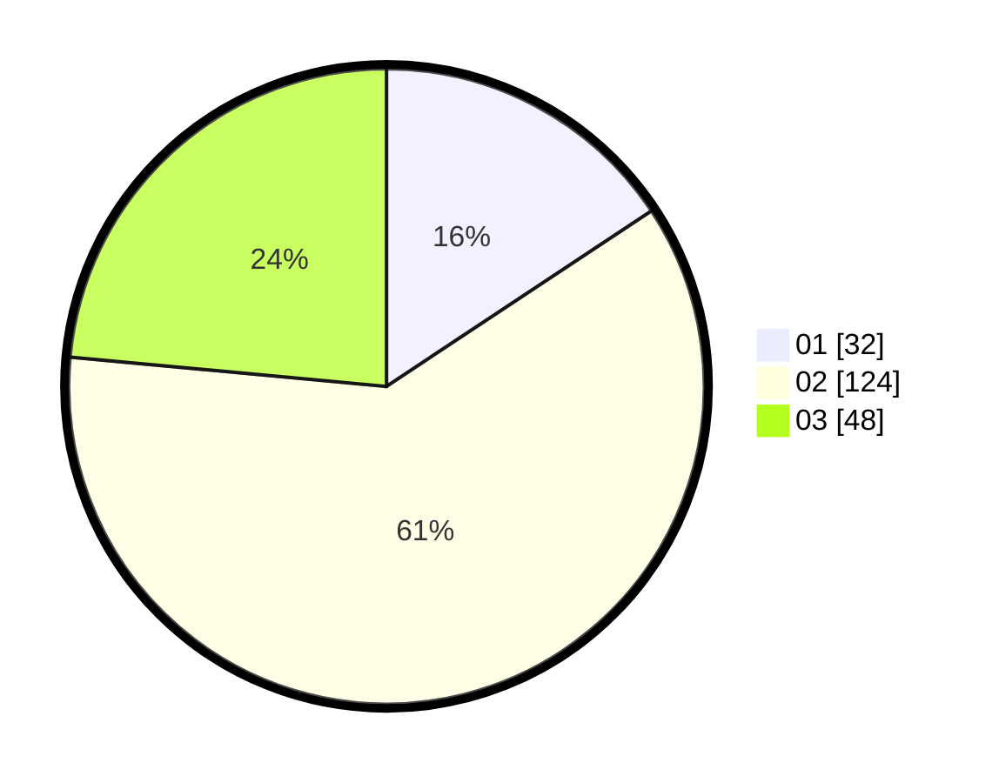

# Hasil

Hasil perolehan suara paslon dapat dilihat pada file paslon-01.txt, paslon-02.txt, dan paslon-03.txt.

Jika tidak ada, artinya data tersebut belum ada pada SIREKAP.

## Perolehan Suara

 * Paslon 01: **32**.
 * Paslon 02: **124**.
 * Paslon 03: **48**.

## Foto C Plano

https://sirekap-obj-formc.kpu.go.id/5a5e/pemilu/ppwp/31/73/02/10/07/3173021007064-20240214-211759--e2b454f9-470e-4366-8ffe-290e879f0300.jpg

https://sirekap-obj-formc.kpu.go.id/5a5e/pemilu/ppwp/31/73/02/10/07/3173021007064-20240216-220950--1074bb18-8f54-4584-8167-5b40e67eed35.jpg

https://sirekap-obj-formc.kpu.go.id/5a5e/pemilu/ppwp/31/73/02/10/07/3173021007064-20240214-201849--71e3d20f-fbbe-439e-84fd-0da8a4209704.jpg

## DATA PEMILIH TETAP

Jumlah pemilih dalam DPT: **248**.
 * L: **125**.
 * P: **123**.

## DATA PENGGUNA HAK PILIH

Jumlah pengguna hak pilih dalam DPT: **183**.
 * L: **91**.
 * P: **92**.

Jumlah pengguna hak pilih dalam DPTb: **25**.
 * L: **14**.
 * P: **11**.

Jumlah pengguna hak pilih dalam DPK: **0**.
 * L: **0**.
 * P: **0**.

Jumlah pengguna hak pilih: **208**.
 * L: **105**.
 * P: **103**.

## JUMLAH SUARA SAH DAN TIDAK SAH

JUMLAH SELURUH SUARA SAH: **204**.

JUMLAH SUARA TIDAK SAH: **4**.

JUMLAH SELURUH SUARA SAH DAN SUARA TIDAK SAH: **208**.
