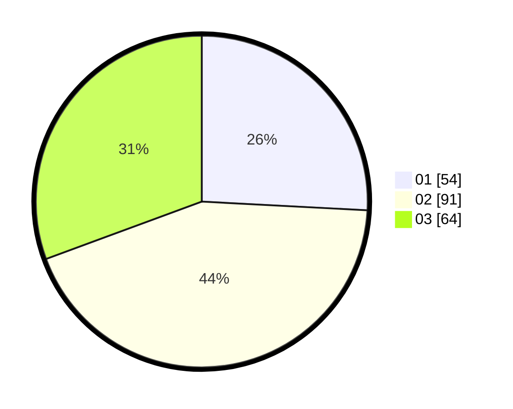

# Hasil

Hasil perolehan suara paslon dapat dilihat pada file paslon-01.txt, paslon-02.txt, dan paslon-03.txt.

Jika tidak ada, artinya data tersebut belum ada pada SIREKAP.

## Perolehan Suara

 * Paslon 01: **54**.
 * Paslon 02: **91**.
 * Paslon 03: **64**.

## Foto C Plano

https://sirekap-obj-formc.kpu.go.id/167f/pemilu/ppwp/31/73/02/10/07/3173021007065-20240216-093408--c2b44593-419b-43aa-8126-c1e4abf96c11.jpg

https://sirekap-obj-formc.kpu.go.id/167f/pemilu/ppwp/31/73/02/10/07/3173021007065-20240216-093410--a16dd570-cf0f-4949-8076-6af725b895a3.jpg

https://sirekap-obj-formc.kpu.go.id/167f/pemilu/ppwp/31/73/02/10/07/3173021007065-20240216-093409--dac2e2a0-cc20-4e11-84b1-6f221fcc763c.jpg

## DATA PEMILIH TETAP

Jumlah pemilih dalam DPT: **271**.
 * L: **142**.
 * P: **129**.

## DATA PENGGUNA HAK PILIH

Jumlah pengguna hak pilih dalam DPT: **204**.
 * L: **106**.
 * P: **98**.

Jumlah pengguna hak pilih dalam DPTb: **2**.
 * L: **1**.
 * P: **1**.

Jumlah pengguna hak pilih dalam DPK: **5**.
 * L: **2**.
 * P: **3**.

Jumlah pengguna hak pilih: **211**.
 * L: **109**.
 * P: **102**.

## JUMLAH SUARA SAH DAN TIDAK SAH

JUMLAH SELURUH SUARA SAH: **209**.

JUMLAH SUARA TIDAK SAH: **2**.

JUMLAH SELURUH SUARA SAH DAN SUARA TIDAK SAH: **211**.
