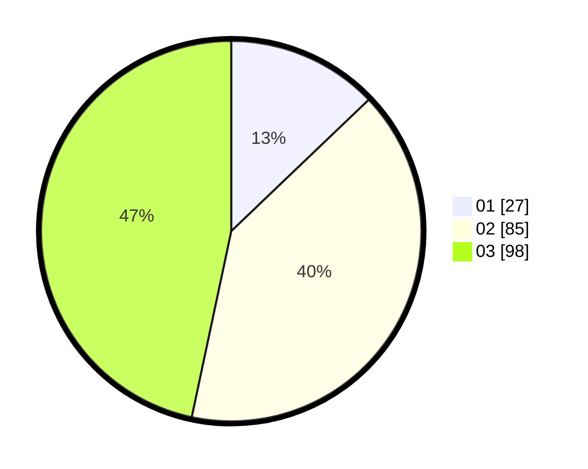

# Hasil

Hasil perolehan suara paslon dapat dilihat pada file paslon-01.txt, paslon-02.txt, dan paslon-03.txt.

Jika tidak ada, artinya data tersebut belum ada pada SIREKAP.

## Perolehan Suara

 * Paslon 01: **27**.
 * Paslon 02: **85**.
 * Paslon 03: **98**.

## Foto C Plano

https://sirekap-obj-formc.kpu.go.id/6e96/pemilu/ppwp/31/73/02/10/07/3173021007070-20240215-142037--08fb5433-cb42-4ca5-b601-85ed878f11ba.jpg

https://sirekap-obj-formc.kpu.go.id/6e96/pemilu/ppwp/31/73/02/10/07/3173021007070-20240215-142045--fdee336e-5542-4657-8f8b-549eb5fd84b3.jpg

https://sirekap-obj-formc.kpu.go.id/6e96/pemilu/ppwp/31/73/02/10/07/3173021007070-20240215-142051--3862b73a-d202-45b6-91ed-9a24bd93fb9f.jpg
