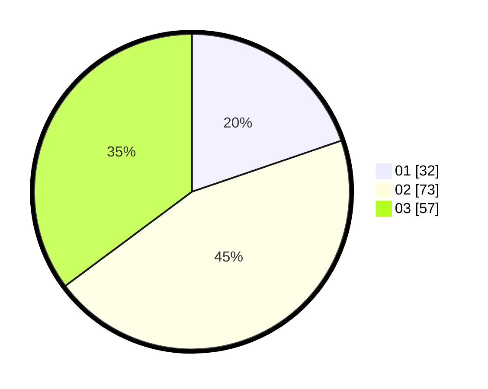

# Hasil

Hasil perolehan suara paslon dapat dilihat pada file paslon-01.txt, paslon-02.txt, dan paslon-03.txt.

Jika tidak ada, artinya data tersebut belum ada pada SIREKAP.

## Perolehan Suara

 * Paslon 01: **32**.
 * Paslon 02: **73**.
 * Paslon 03: **57**.

## Foto C Plano

https://sirekap-obj-formc.kpu.go.id/9254/pemilu/ppwp/31/73/02/10/07/3173021007071-20240215-014548--0b2557c2-1457-4ae1-9824-f9202e17d621.jpg

https://sirekap-obj-formc.kpu.go.id/9254/pemilu/ppwp/31/73/02/10/07/3173021007071-20240215-014801--372dfcc1-805d-49b5-bfda-419e2baf9374.jpg

https://sirekap-obj-formc.kpu.go.id/9254/pemilu/ppwp/31/73/02/10/07/3173021007071-20240215-014924--46f7dc62-922e-40b4-9992-a9faafb6d5ba.jpg
