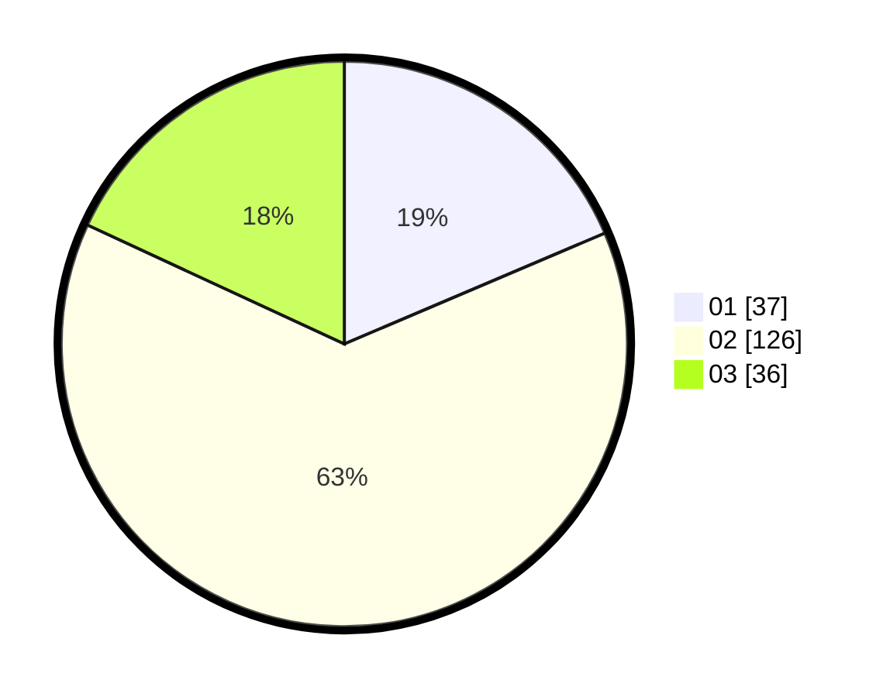

# Hasil

Hasil perolehan suara paslon dapat dilihat pada file paslon-01.txt, paslon-02.txt, dan paslon-03.txt.

Jika tidak ada, artinya data tersebut belum ada pada SIREKAP.

## Perolehan Suara

 * Paslon 01: **37**.
 * Paslon 02: **126**.
 * Paslon 03: **36**.

## Foto C Plano

https://sirekap-obj-formc.kpu.go.id/b212/pemilu/ppwp/31/73/02/10/07/3173021007077-20240214-205418--30663665-a27b-47a6-98db-6adf43af101e.jpg

https://sirekap-obj-formc.kpu.go.id/b212/pemilu/ppwp/31/73/02/10/07/3173021007077-20240214-205932--693db872-355a-4d9f-bddd-74c865751555.jpg

https://sirekap-obj-formc.kpu.go.id/b212/pemilu/ppwp/31/73/02/10/07/3173021007077-20240214-211049--25299d22-c1c1-42ba-8d7f-f4c2e4ffcfb4.jpg

## DATA PEMILIH TETAP

Jumlah pemilih dalam DPT: **278**.
 * L: **141**.
 * P: **137**.

## DATA PENGGUNA HAK PILIH

Jumlah pengguna hak pilih dalam DPT: **194**.
 * L: **93**.
 * P: **101**.

Jumlah pengguna hak pilih dalam DPTb: **8**.
 * L: **5**.
 * P: **3**.

Jumlah pengguna hak pilih dalam DPK: **2**.
 * L: **1**.
 * P: **1**.

Jumlah pengguna hak pilih: **204**.
 * L: **99**.
 * P: **105**.

## JUMLAH SUARA SAH DAN TIDAK SAH

JUMLAH SELURUH SUARA SAH: **199**.

JUMLAH SUARA TIDAK SAH: **5**.

JUMLAH SELURUH SUARA SAH DAN SUARA TIDAK SAH: **204**.
