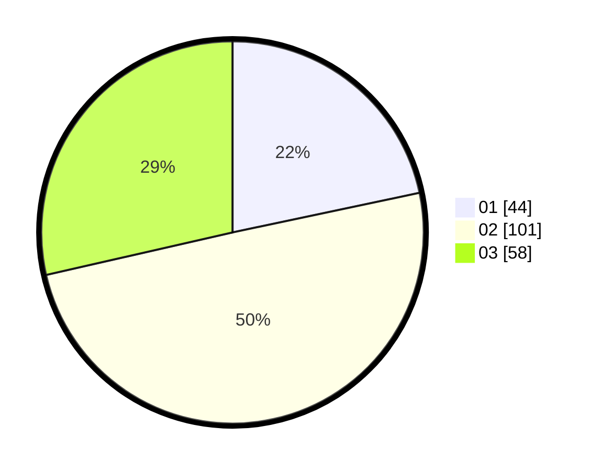

# Hasil

Hasil perolehan suara paslon dapat dilihat pada file paslon-01.txt, paslon-02.txt, dan paslon-03.txt.

Jika tidak ada, artinya data tersebut belum ada pada SIREKAP.

## Perolehan Suara

 * Paslon 01: **44**.
 * Paslon 02: **101**.
 * Paslon 03: **58**.

## Foto C Plano

https://sirekap-obj-formc.kpu.go.id/40d4/pemilu/ppwp/31/73/02/10/07/3173021007078-20240214-222424--37c66db2-c960-4c3f-ab44-ee838d8eb775.jpg

https://sirekap-obj-formc.kpu.go.id/40d4/pemilu/ppwp/31/73/02/10/07/3173021007078-20240214-222448--3be02f5a-8a0c-46c9-87b7-f3d10046a846.jpg

https://sirekap-obj-formc.kpu.go.id/40d4/pemilu/ppwp/31/73/02/10/07/3173021007078-20240214-222613--e8179b93-ad58-475b-994b-dda24d572dcf.jpg
