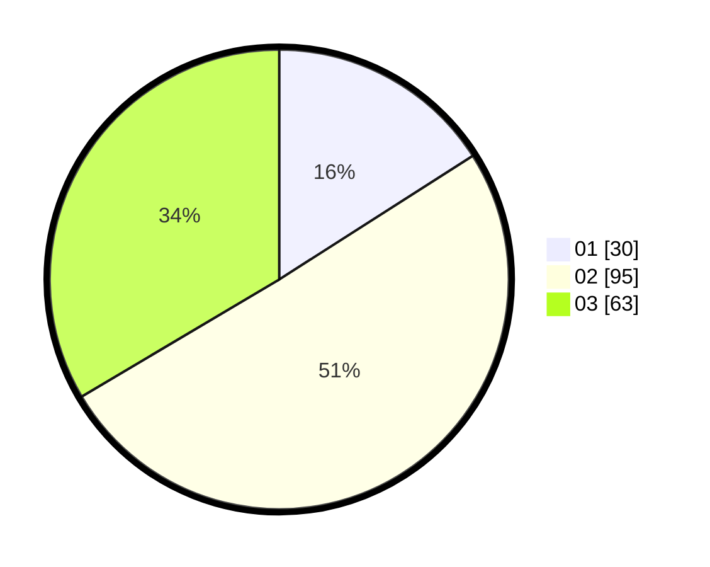

# Hasil

Hasil perolehan suara paslon dapat dilihat pada file paslon-01.txt, paslon-02.txt, dan paslon-03.txt.

Jika tidak ada, artinya data tersebut belum ada pada SIREKAP.

## Perolehan Suara

 * Paslon 01: **30**.
 * Paslon 02: **95**.
 * Paslon 03: **63**.

## Foto C Plano

https://sirekap-obj-formc.kpu.go.id/6aa2/pemilu/ppwp/31/73/02/10/07/3173021007081-20240214-234605--f47044d0-0da1-45ba-9f28-8b2b95be5e37.jpg

https://sirekap-obj-formc.kpu.go.id/6aa2/pemilu/ppwp/31/73/02/10/07/3173021007081-20240214-234725--2e59ad5b-4d71-4404-8afa-40633b3dd9c4.jpg

https://sirekap-obj-formc.kpu.go.id/6aa2/pemilu/ppwp/31/73/02/10/07/3173021007081-20240214-234810--7b88c40e-bac0-4245-9ac4-2ca503b45ac3.jpg

## DATA PEMILIH TETAP

Jumlah pemilih dalam DPT: **266**.
 * L: **122**.
 * P: **144**.

## DATA PENGGUNA HAK PILIH

Jumlah pengguna hak pilih dalam DPT: **188**.
 * L: **87**.
 * P: **101**.

Jumlah pengguna hak pilih dalam DPTb: **0**.
 * L: **0**.
 * P: **0**.

Jumlah pengguna hak pilih dalam DPK: **0**.
 * L: **0**.
 * P: **0**.

Jumlah pengguna hak pilih: **188**.
 * L: **188**.
 * P: **0**.

## JUMLAH SUARA SAH DAN TIDAK SAH

JUMLAH SELURUH SUARA SAH: **188**.

JUMLAH SUARA TIDAK SAH: **0**.

JUMLAH SELURUH SUARA SAH DAN SUARA TIDAK SAH: **188**.
