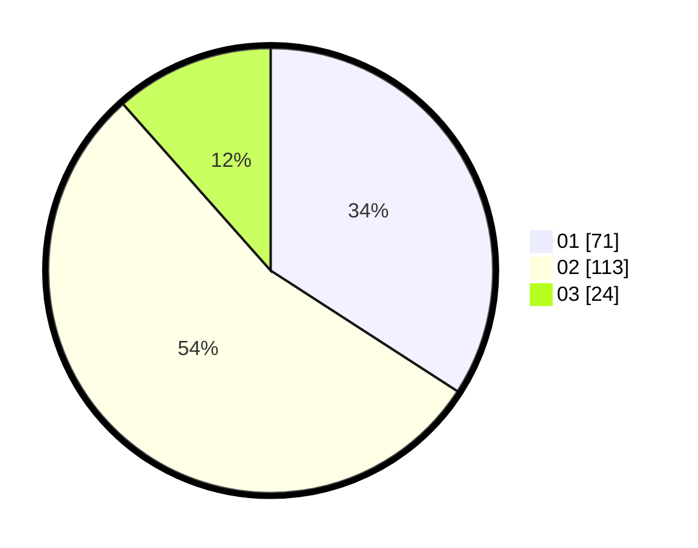

# Hasil

Hasil perolehan suara paslon dapat dilihat pada file paslon-01.txt, paslon-02.txt, dan paslon-03.txt.

Jika tidak ada, artinya data tersebut belum ada pada SIREKAP.

## Perolehan Suara

 * Paslon 01: **71**.
 * Paslon 02: **113**.
 * Paslon 03: **24**.

## Foto C Plano

https://sirekap-obj-formc.kpu.go.id/447e/pemilu/ppwp/31/73/02/10/07/3173021007087-20240218-222201--8fb4ec9e-93eb-4b7c-9c66-bac23b4cd49f.jpg

https://sirekap-obj-formc.kpu.go.id/447e/pemilu/ppwp/31/73/02/10/07/3173021007087-20240218-132934--0bc47086-feca-41c2-9bf9-51a1c8f87338.jpg

https://sirekap-obj-formc.kpu.go.id/447e/pemilu/ppwp/31/73/02/10/07/3173021007087-20240218-132706--c6f6c9dd-9270-4cbc-8d29-9c38c770c82e.jpg
