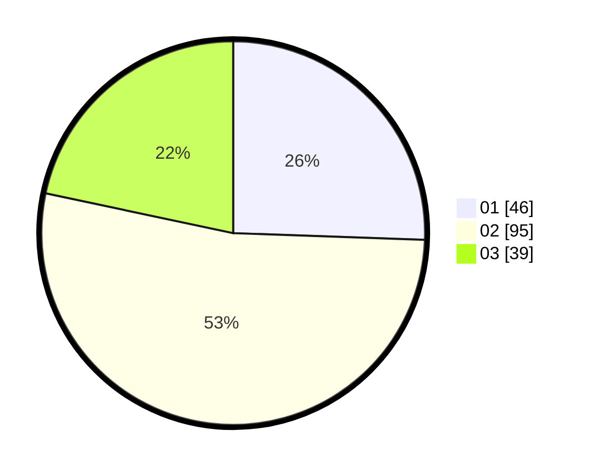

# Hasil

Hasil perolehan suara paslon dapat dilihat pada file paslon-01.txt, paslon-02.txt, dan paslon-03.txt.

Jika tidak ada, artinya data tersebut belum ada pada SIREKAP.

## Perolehan Suara

 * Paslon 01: **46**.
 * Paslon 02: **95**.
 * Paslon 03: **39**.

## Foto C Plano

https://sirekap-obj-formc.kpu.go.id/fb60/pemilu/ppwp/31/73/02/10/07/3173021007089-20240216-122837--8e1d4939-5757-4c74-a286-3ff9efc49dcc.jpg

https://sirekap-obj-formc.kpu.go.id/fb60/pemilu/ppwp/31/73/02/10/07/3173021007089-20240216-122843--6b8799dd-6320-4fa5-8be6-b24c60f91bc8.jpg

https://sirekap-obj-formc.kpu.go.id/fb60/pemilu/ppwp/31/73/02/10/07/3173021007089-20240216-122840--51eced88-90ae-4854-a1dc-924cd3cb8588.jpg

## DATA PEMILIH TETAP

Jumlah pemilih dalam DPT: **277**.
 * L: **140**.
 * P: **137**.

## DATA PENGGUNA HAK PILIH

Jumlah pengguna hak pilih dalam DPT: **184**.
 * L: **94**.
 * P: **90**.

Jumlah pengguna hak pilih dalam DPTb: **1**.
 * L: **1**.
 * P: **0**.

Jumlah pengguna hak pilih dalam DPK: **0**.
 * L: **0**.
 * P: **0**.

Jumlah pengguna hak pilih: **185**.
 * L: **95**.
 * P: **90**.

## JUMLAH SUARA SAH DAN TIDAK SAH

JUMLAH SELURUH SUARA SAH: **180**.

JUMLAH SUARA TIDAK SAH: **5**.

JUMLAH SELURUH SUARA SAH DAN SUARA TIDAK SAH: **185**.
