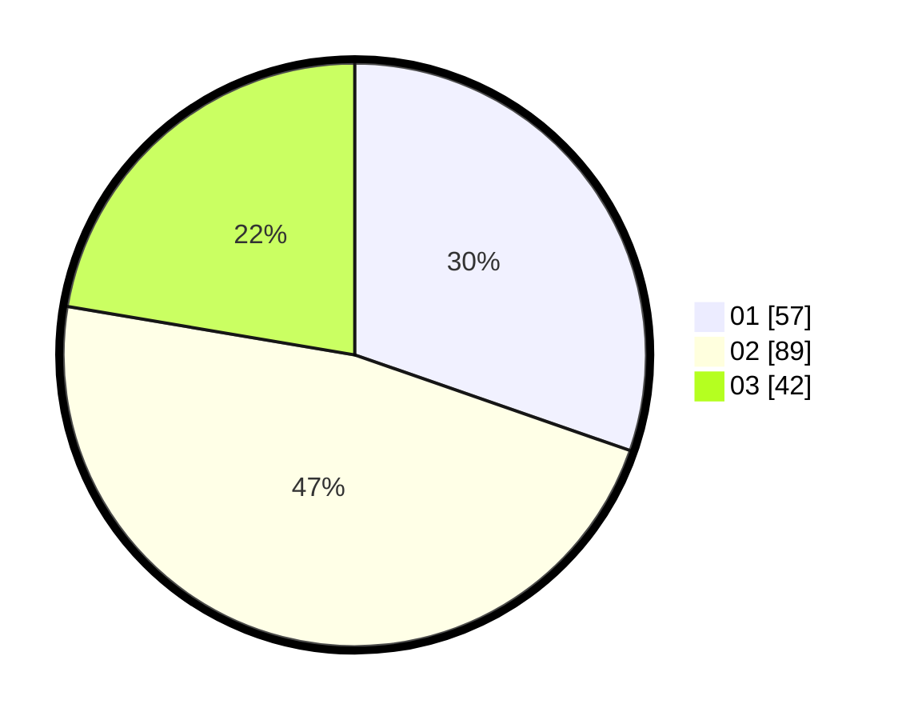

# Hasil

Hasil perolehan suara paslon dapat dilihat pada file paslon-01.txt, paslon-02.txt, dan paslon-03.txt.

Jika tidak ada, artinya data tersebut belum ada pada SIREKAP.

## Perolehan Suara

 * Paslon 01: **57**.
 * Paslon 02: **89**.
 * Paslon 03: **42**.

## Foto C Plano

https://sirekap-obj-formc.kpu.go.id/af46/pemilu/ppwp/31/73/02/10/07/3173021007095-20240215-003016--d7a3dc30-4c82-42bd-a986-f3c8c3e7cfd9.jpg

https://sirekap-obj-formc.kpu.go.id/af46/pemilu/ppwp/31/73/02/10/07/3173021007095-20240215-002449--89cea20b-03dd-4525-ad08-6eac805c7d77.jpg

https://sirekap-obj-formc.kpu.go.id/af46/pemilu/ppwp/31/73/02/10/07/3173021007095-20240215-003217--bcefd588-10bb-4161-9d42-7076e99b91a2.jpg
