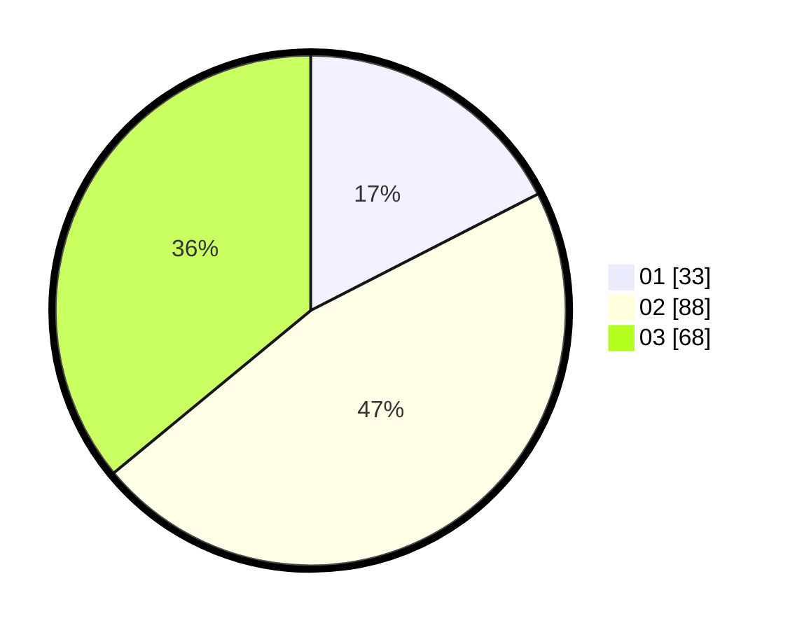

# Hasil

Hasil perolehan suara paslon dapat dilihat pada file paslon-01.txt, paslon-02.txt, dan paslon-03.txt.

Jika tidak ada, artinya data tersebut belum ada pada SIREKAP.

## Perolehan Suara

 * Paslon 01: **33**.
 * Paslon 02: **88**.
 * Paslon 03: **68**.

## Foto C Plano

https://sirekap-obj-formc.kpu.go.id/4585/pemilu/ppwp/31/73/02/10/07/3173021007096-20240215-001622--e5a4b406-ea32-4342-8917-663c79a9401c.jpg

https://sirekap-obj-formc.kpu.go.id/4585/pemilu/ppwp/31/73/02/10/07/3173021007096-20240215-001828--5308c2e7-d8e9-46fc-9a1f-cd81f4899cef.jpg

https://sirekap-obj-formc.kpu.go.id/4585/pemilu/ppwp/31/73/02/10/07/3173021007096-20240215-002132--d32341bf-198c-4083-9b94-64980535efce.jpg
