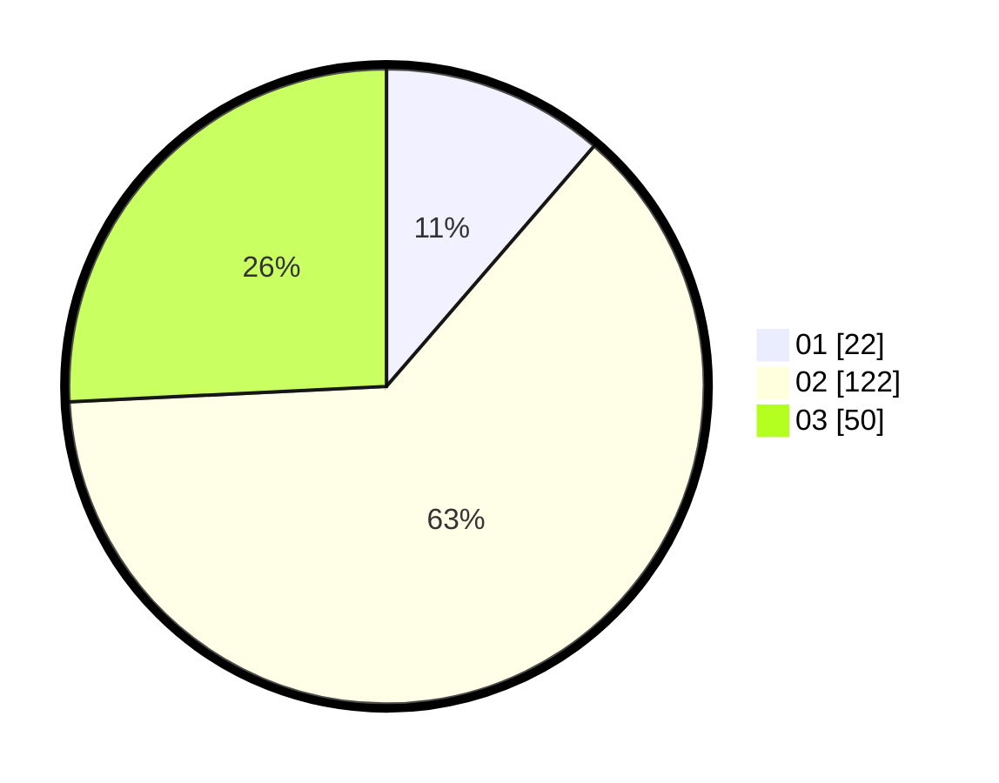

# Hasil

Hasil perolehan suara paslon dapat dilihat pada file paslon-01.txt, paslon-02.txt, dan paslon-03.txt.

Jika tidak ada, artinya data tersebut belum ada pada SIREKAP.

## Perolehan Suara

 * Paslon 01: **22**.
 * Paslon 02: **122**.
 * Paslon 03: **50**.

## Foto C Plano

https://sirekap-obj-formc.kpu.go.id/8518/pemilu/ppwp/31/73/02/10/07/3173021007097-20240217-114835--b2553467-6e4a-4e93-94e9-164a6fa4418b.jpg

https://sirekap-obj-formc.kpu.go.id/8518/pemilu/ppwp/31/73/02/10/07/3173021007097-20240217-112850--50fe79fe-207f-47ea-a9fc-bde08d38709b.jpg

https://sirekap-obj-formc.kpu.go.id/8518/pemilu/ppwp/31/73/02/10/07/3173021007097-20240217-114836--2be0d7f8-071c-487b-b437-9b2b43bccd9e.jpg

## DATA PEMILIH TETAP

Jumlah pemilih dalam DPT: **276**.
 * L: **133**.
 * P: **143**.

## DATA PENGGUNA HAK PILIH

Jumlah pengguna hak pilih dalam DPT: **201**.
 * L: **94**.
 * P: **107**.

Jumlah pengguna hak pilih dalam DPTb: **3**.
 * L: **2**.
 * P: **1**.

Jumlah pengguna hak pilih dalam DPK: **2**.
 * L: **2**.
 * P: **0**.

Jumlah pengguna hak pilih: **206**.
 * L: **98**.
 * P: **108**.

## JUMLAH SUARA SAH DAN TIDAK SAH

JUMLAH SELURUH SUARA SAH: **206**.

JUMLAH SUARA TIDAK SAH: **0**.

JUMLAH SELURUH SUARA SAH DAN SUARA TIDAK SAH: **206**.
