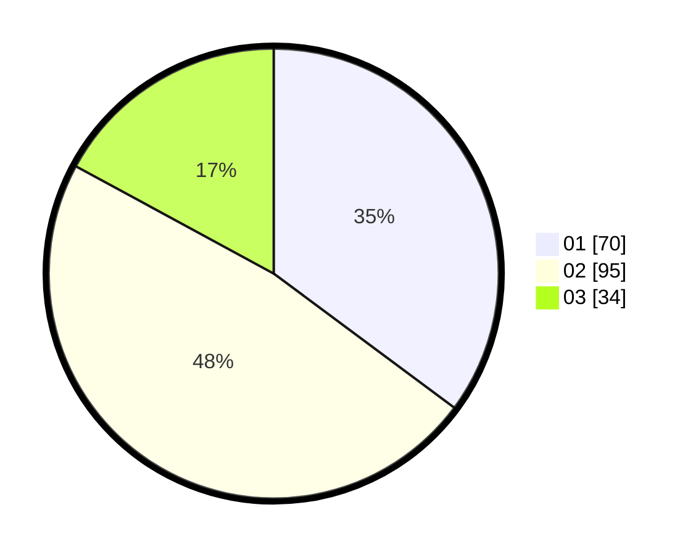

# Hasil

Hasil perolehan suara paslon dapat dilihat pada file paslon-01.txt, paslon-02.txt, dan paslon-03.txt.

Jika tidak ada, artinya data tersebut belum ada pada SIREKAP.

## Perolehan Suara

 * Paslon 01: **70**.
 * Paslon 02: **95**.
 * Paslon 03: **34**.

## Foto C Plano

https://sirekap-obj-formc.kpu.go.id/876a/pemilu/ppwp/31/73/02/10/07/3173021007098-20240215-014007--d29a5b6a-4c64-4890-9fe8-57a3c3e0b32f.jpg

https://sirekap-obj-formc.kpu.go.id/876a/pemilu/ppwp/31/73/02/10/07/3173021007098-20240215-014231--d2d5fc78-809e-4158-a0e8-7ac03838fc03.jpg

https://sirekap-obj-formc.kpu.go.id/876a/pemilu/ppwp/31/73/02/10/07/3173021007098-20240215-014340--2ec8febe-8821-4302-ae14-ed5b8acdcb93.jpg
