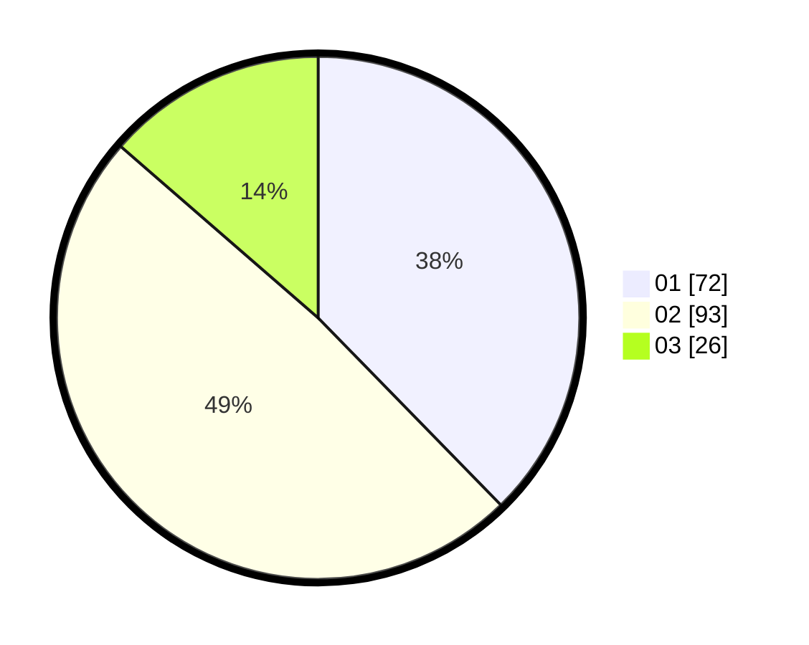

# Hasil

Hasil perolehan suara paslon dapat dilihat pada file paslon-01.txt, paslon-02.txt, dan paslon-03.txt.

Jika tidak ada, artinya data tersebut belum ada pada SIREKAP.

## Perolehan Suara

 * Paslon 01: **72**.
 * Paslon 02: **93**.
 * Paslon 03: **26**.

## Foto C Plano

https://sirekap-obj-formc.kpu.go.id/7810/pemilu/ppwp/31/73/02/10/07/3173021007100-20240214-233733--01fe9aaf-541d-4117-9cb7-47311170a5c2.jpg

https://sirekap-obj-formc.kpu.go.id/7810/pemilu/ppwp/31/73/02/10/07/3173021007100-20240214-233857--ca027380-996b-4271-a775-f01d7d4c0615.jpg
