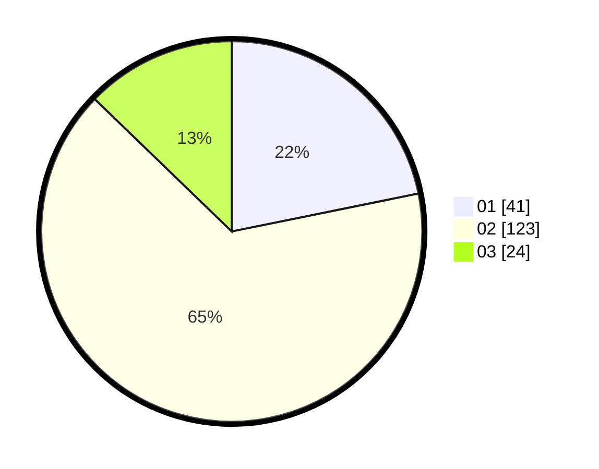

# Hasil

Hasil perolehan suara paslon dapat dilihat pada file paslon-01.txt, paslon-02.txt, dan paslon-03.txt.

Jika tidak ada, artinya data tersebut belum ada pada SIREKAP.

## Perolehan Suara

 * Paslon 01: **41**.
 * Paslon 02: **123**.
 * Paslon 03: **24**.

## Foto C Plano

https://sirekap-obj-formc.kpu.go.id/4f34/pemilu/ppwp/31/73/02/10/07/3173021007104-20240216-135947--42a0e20e-a107-40e4-a2e6-833d4c8857b6.jpg

https://sirekap-obj-formc.kpu.go.id/4f34/pemilu/ppwp/31/73/02/10/07/3173021007104-20240216-135948--73421c7e-e92c-45dc-9fbe-f851fc11e999.jpg

https://sirekap-obj-formc.kpu.go.id/4f34/pemilu/ppwp/31/73/02/10/07/3173021007104-20240216-135947--b22094c0-eb27-4bff-b9c8-92a17091bf90.jpg

## DATA PEMILIH TETAP

Jumlah pemilih dalam DPT: **260**.
 * L: **136**.
 * P: **124**.

## DATA PENGGUNA HAK PILIH

Jumlah pengguna hak pilih dalam DPT: **185**.
 * L: **89**.
 * P: **96**.

Jumlah pengguna hak pilih dalam DPTb: **3**.
 * L: **2**.
 * P: **1**.

Jumlah pengguna hak pilih dalam DPK: **3**.
 * L: **3**.
 * P: **0**.

Jumlah pengguna hak pilih: **191**.
 * L: **94**.
 * P: **97**.

## JUMLAH SUARA SAH DAN TIDAK SAH

JUMLAH SELURUH SUARA SAH: **188**.

JUMLAH SUARA TIDAK SAH: **3**.

JUMLAH SELURUH SUARA SAH DAN SUARA TIDAK SAH: **191**.
