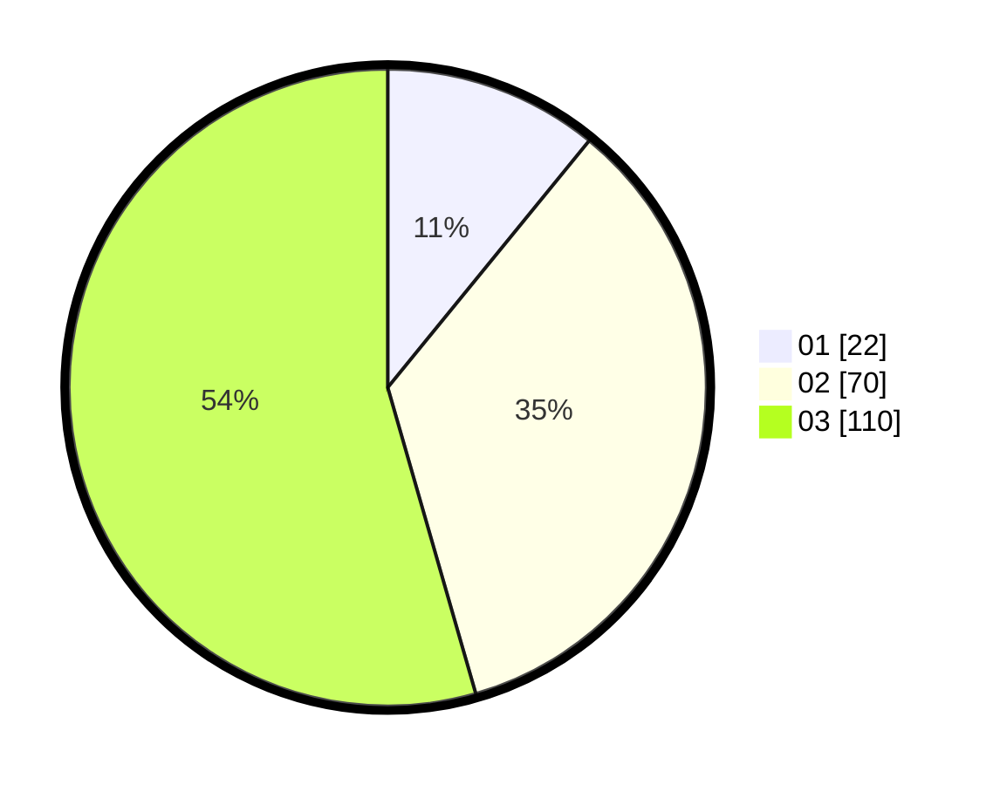

# Hasil

Hasil perolehan suara paslon dapat dilihat pada file paslon-01.txt, paslon-02.txt, dan paslon-03.txt.

Jika tidak ada, artinya data tersebut belum ada pada SIREKAP.

## Perolehan Suara

 * Paslon 01: **22**.
 * Paslon 02: **70**.
 * Paslon 03: **110**.

## Foto C Plano

https://sirekap-obj-formc.kpu.go.id/5c05/pemilu/ppwp/31/73/02/10/07/3173021007108-20240214-213343--d1526270-2d7e-40d7-85e0-90ada034a1ce.jpg

https://sirekap-obj-formc.kpu.go.id/5c05/pemilu/ppwp/31/73/02/10/07/3173021007108-20240214-224217--fbab5a57-25ca-463c-a8e2-65ad748617f5.jpg

https://sirekap-obj-formc.kpu.go.id/5c05/pemilu/ppwp/31/73/02/10/07/3173021007108-20240214-213444--6e6fbce7-f171-4c84-a041-4f5e627586f2.jpg

## DATA PEMILIH TETAP

Jumlah pemilih dalam DPT: **253**.
 * L: **106**.
 * P: **147**.

## DATA PENGGUNA HAK PILIH

Jumlah pengguna hak pilih dalam DPT: **190**.
 * L: **83**.
 * P: **107**.

Jumlah pengguna hak pilih dalam DPTb: **15**.
 * L: **14**.
 * P: **1**.

Jumlah pengguna hak pilih dalam DPK: **2**.
 * L: **1**.
 * P: **1**.

Jumlah pengguna hak pilih: **207**.
 * L: **98**.
 * P: **109**.

## JUMLAH SUARA SAH DAN TIDAK SAH

JUMLAH SELURUH SUARA SAH: **202**.

JUMLAH SUARA TIDAK SAH: **5**.

JUMLAH SELURUH SUARA SAH DAN SUARA TIDAK SAH: **207**.
