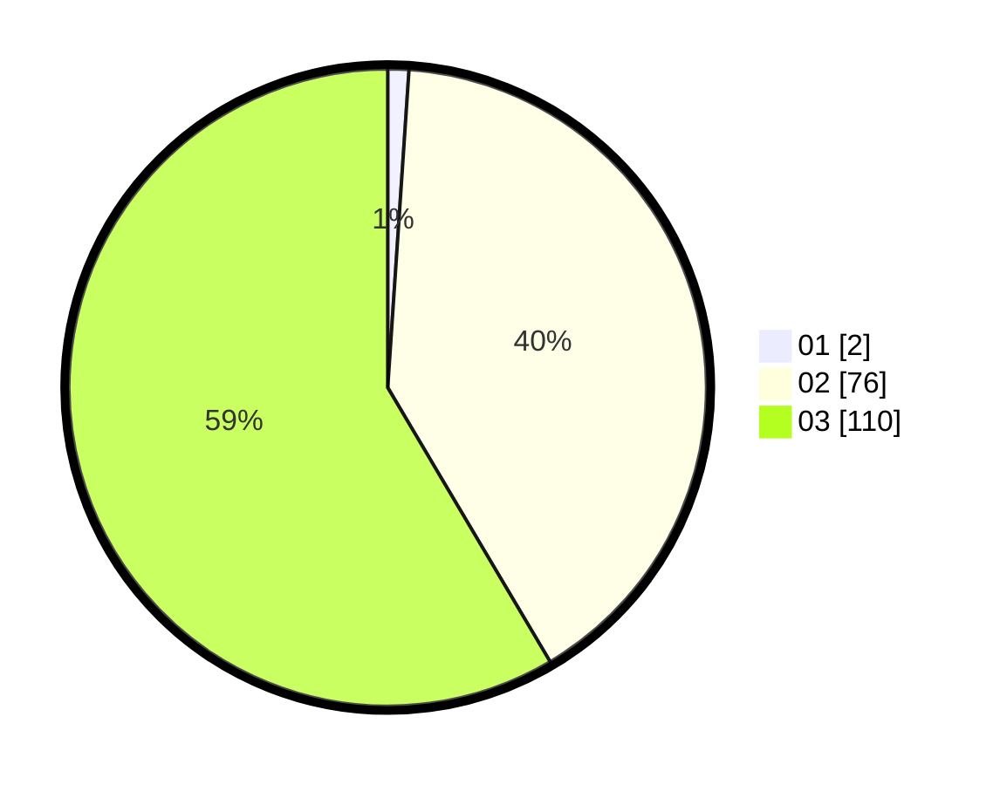

# Hasil

Hasil perolehan suara paslon dapat dilihat pada file paslon-01.txt, paslon-02.txt, dan paslon-03.txt.

Jika tidak ada, artinya data tersebut belum ada pada SIREKAP.

## Perolehan Suara

 * Paslon 01: **2**.
 * Paslon 02: **76**.
 * Paslon 03: **110**.

## Foto C Plano

https://sirekap-obj-formc.kpu.go.id/b854/pemilu/ppwp/31/73/02/10/07/3173021007112-20240214-155632--c423ab43-e1b1-410e-97e4-aa3ce0a4ae4a.jpg

https://sirekap-obj-formc.kpu.go.id/b854/pemilu/ppwp/31/73/02/10/07/3173021007112-20240214-155256--e2cf960e-5276-42cb-818b-775aa76d42d3.jpg

https://sirekap-obj-formc.kpu.go.id/b854/pemilu/ppwp/31/73/02/10/07/3173021007112-20240214-155442--3254c81f-d9b8-42e3-8d16-8055677cff7c.jpg

## DATA PEMILIH TETAP

Jumlah pemilih dalam DPT: **273**.
 * L: **126**.
 * P: **147**.

## DATA PENGGUNA HAK PILIH

Jumlah pengguna hak pilih dalam DPT: **189**.
 * L: **88**.
 * P: **101**.

Jumlah pengguna hak pilih dalam DPTb: **2**.
 * L: **1**.
 * P: **1**.

Jumlah pengguna hak pilih dalam DPK: **2**.
 * L: **1**.
 * P: **1**.

Jumlah pengguna hak pilih: **193**.
 * L: **90**.
 * P: **103**.

## JUMLAH SUARA SAH DAN TIDAK SAH

JUMLAH SELURUH SUARA SAH: **188**.

JUMLAH SUARA TIDAK SAH: **5**.

JUMLAH SELURUH SUARA SAH DAN SUARA TIDAK SAH: **193**.
