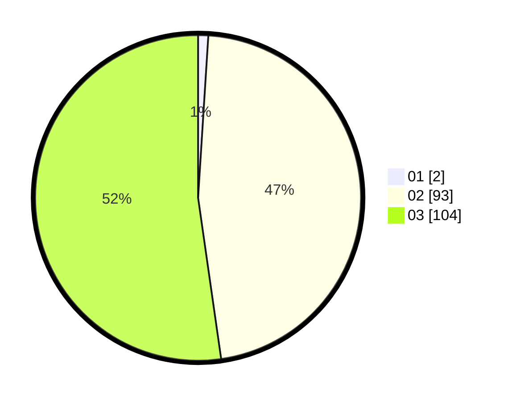

# Hasil

Hasil perolehan suara paslon dapat dilihat pada file paslon-01.txt, paslon-02.txt, dan paslon-03.txt.

Jika tidak ada, artinya data tersebut belum ada pada SIREKAP.

## Perolehan Suara

 * Paslon 01: **2**.
 * Paslon 02: **93**.
 * Paslon 03: **104**.

## Foto C Plano

https://sirekap-obj-formc.kpu.go.id/e553/pemilu/ppwp/31/73/02/10/07/3173021007113-20240214-195618--9ca56803-551b-42b7-879e-b0c370b0efc9.jpg

https://sirekap-obj-formc.kpu.go.id/e553/pemilu/ppwp/31/73/02/10/07/3173021007113-20240214-195628--3826339c-9d42-48f1-b01f-6f72716d6d0f.jpg

https://sirekap-obj-formc.kpu.go.id/e553/pemilu/ppwp/31/73/02/10/07/3173021007113-20240214-212143--9e4d710c-6341-48b9-beff-70cc5bb8d9fd.jpg

## DATA PEMILIH TETAP

Jumlah pemilih dalam DPT: **295**.
 * L: **145**.
 * P: **150**.

## DATA PENGGUNA HAK PILIH

Jumlah pengguna hak pilih dalam DPT: **197**.
 * L: **94**.
 * P: **103**.

Jumlah pengguna hak pilih dalam DPTb: **5**.
 * L: **5**.
 * P: **0**.

Jumlah pengguna hak pilih dalam DPK: **0**.
 * L: **0**.
 * P: **0**.

Jumlah pengguna hak pilih: **202**.
 * L: **99**.
 * P: **103**.

## JUMLAH SUARA SAH DAN TIDAK SAH

JUMLAH SELURUH SUARA SAH: **199**.

JUMLAH SUARA TIDAK SAH: **3**.

JUMLAH SELURUH SUARA SAH DAN SUARA TIDAK SAH: **207**.
