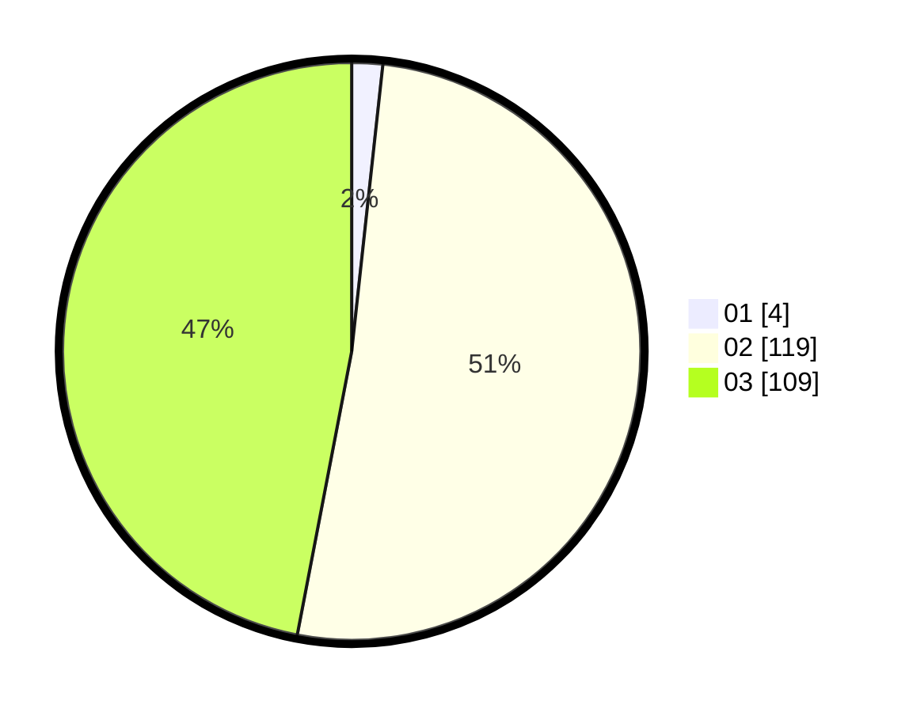

# Hasil

Hasil perolehan suara paslon dapat dilihat pada file paslon-01.txt, paslon-02.txt, dan paslon-03.txt.

Jika tidak ada, artinya data tersebut belum ada pada SIREKAP.

## Perolehan Suara

 * Paslon 01: **4**.
 * Paslon 02: **119**.
 * Paslon 03: **109**.

## Foto C Plano

https://sirekap-obj-formc.kpu.go.id/cf10/pemilu/ppwp/31/73/02/10/07/3173021007115-20240214-193310--8b16f879-f463-44b4-a3a6-b825d44a0263.jpg

https://sirekap-obj-formc.kpu.go.id/cf10/pemilu/ppwp/31/73/02/10/07/3173021007115-20240214-193847--234cb8c5-6086-44cc-9b6c-0790ae077dd1.jpg

https://sirekap-obj-formc.kpu.go.id/cf10/pemilu/ppwp/31/73/02/10/07/3173021007115-20240214-194026--ecf3c4f3-cb52-4f47-9d98-8ca3ad98d2a7.jpg

## DATA PEMILIH TETAP

Jumlah pemilih dalam DPT: **284**.
 * L: **129**.
 * P: **155**.

## DATA PENGGUNA HAK PILIH

Jumlah pengguna hak pilih dalam DPT: **198**.
 * L: **91**.
 * P: **107**.

Jumlah pengguna hak pilih dalam DPTb: **32**.
 * L: **18**.
 * P: **14**.

Jumlah pengguna hak pilih dalam DPK: **2**.
 * L: **1**.
 * P: **1**.

Jumlah pengguna hak pilih: **232**.
 * L: **110**.
 * P: **122**.

## JUMLAH SUARA SAH DAN TIDAK SAH

JUMLAH SELURUH SUARA SAH: **232**.

JUMLAH SUARA TIDAK SAH: **0**.

JUMLAH SELURUH SUARA SAH DAN SUARA TIDAK SAH: **232**.
