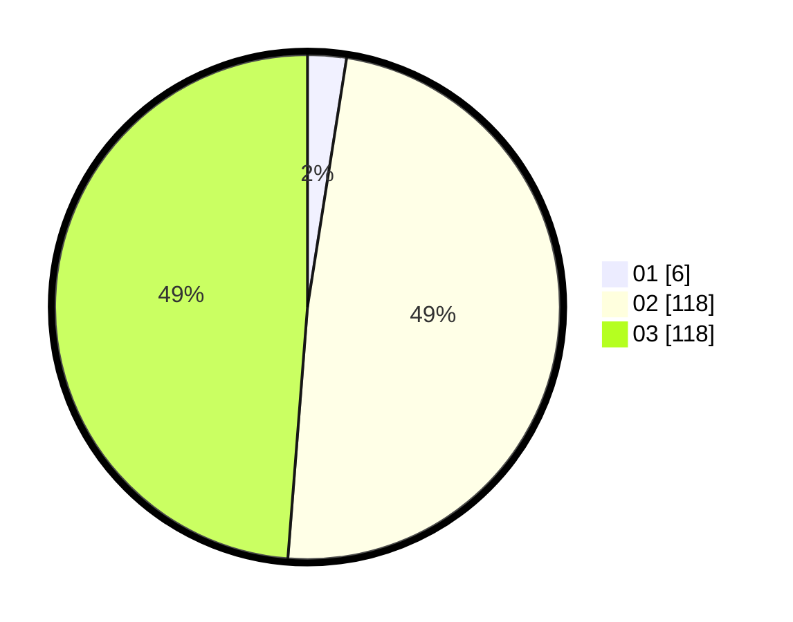

# Hasil

Hasil perolehan suara paslon dapat dilihat pada file paslon-01.txt, paslon-02.txt, dan paslon-03.txt.

Jika tidak ada, artinya data tersebut belum ada pada SIREKAP.

## Perolehan Suara

 * Paslon 01: **6**.
 * Paslon 02: **118**.
 * Paslon 03: **118**.

## Foto C Plano

https://sirekap-obj-formc.kpu.go.id/8214/pemilu/ppwp/31/73/02/10/07/3173021007116-20240214-220420--4cef4c35-7186-43b5-a024-c583058bd39e.jpg

https://sirekap-obj-formc.kpu.go.id/8214/pemilu/ppwp/31/73/02/10/07/3173021007116-20240214-221939--96594a2c-7ecc-4671-ac10-b8945ab52ee3.jpg

https://sirekap-obj-formc.kpu.go.id/8214/pemilu/ppwp/31/73/02/10/07/3173021007116-20240214-221756--df3ca1aa-819a-4a51-ad1c-9586ea7b177c.jpg
