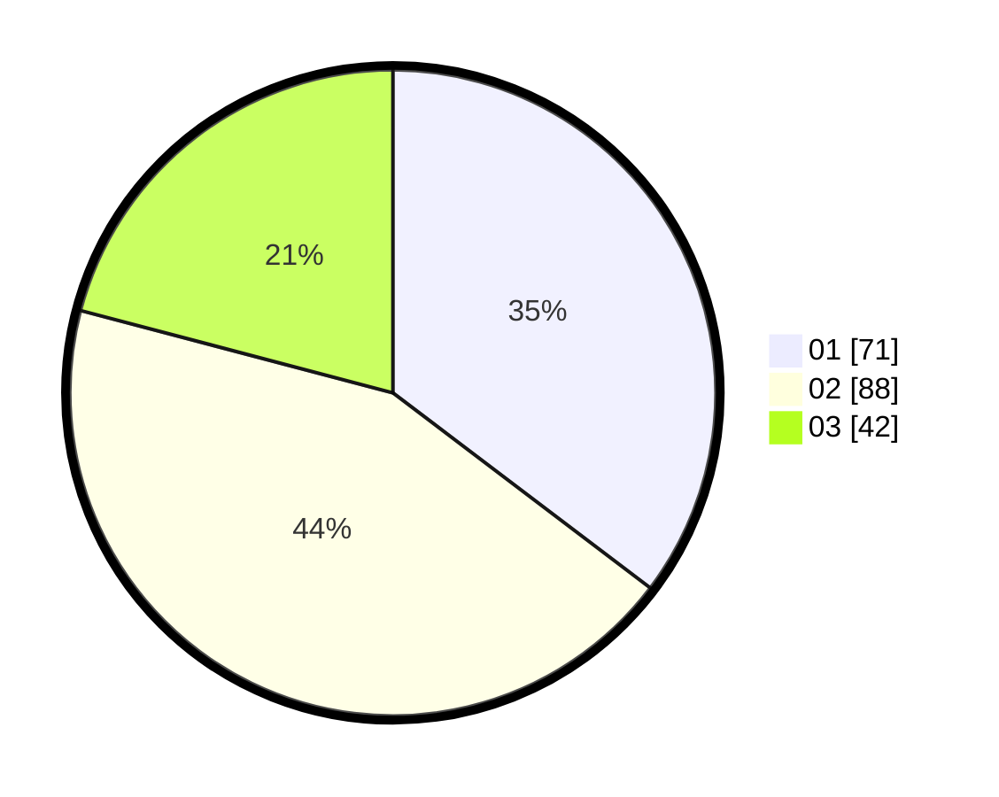

# Hasil

Hasil perolehan suara paslon dapat dilihat pada file paslon-01.txt, paslon-02.txt, dan paslon-03.txt.

Jika tidak ada, artinya data tersebut belum ada pada SIREKAP.

## Perolehan Suara

 * Paslon 01: **71**.
 * Paslon 02: **88**.
 * Paslon 03: **42**.

## Foto C Plano

https://sirekap-obj-formc.kpu.go.id/201b/pemilu/ppwp/31/73/02/10/07/3173021007119-20240216-080139--a76da888-6689-42ce-a4e3-13077bbff2dd.jpg

https://sirekap-obj-formc.kpu.go.id/201b/pemilu/ppwp/31/73/02/10/07/3173021007119-20240216-080143--3abf0244-64da-41ce-8555-14d5626190da.jpg

https://sirekap-obj-formc.kpu.go.id/201b/pemilu/ppwp/31/73/02/10/07/3173021007119-20240216-080141--e4742810-63ae-4b4b-ac98-e02ec9ca3787.jpg

## DATA PEMILIH TETAP

Jumlah pemilih dalam DPT: **255**.
 * L: **126**.
 * P: **129**.

## DATA PENGGUNA HAK PILIH

Jumlah pengguna hak pilih dalam DPT: **200**.
 * L: **95**.
 * P: **105**.

Jumlah pengguna hak pilih dalam DPTb: **1**.
 * L: **0**.
 * P: **1**.

Jumlah pengguna hak pilih dalam DPK: **1**.
 * L: **0**.
 * P: **1**.

Jumlah pengguna hak pilih: **202**.
 * L: **95**.
 * P: **107**.

## JUMLAH SUARA SAH DAN TIDAK SAH

JUMLAH SELURUH SUARA SAH: **201**.

JUMLAH SUARA TIDAK SAH: **1**.

JUMLAH SELURUH SUARA SAH DAN SUARA TIDAK SAH: **202**.
