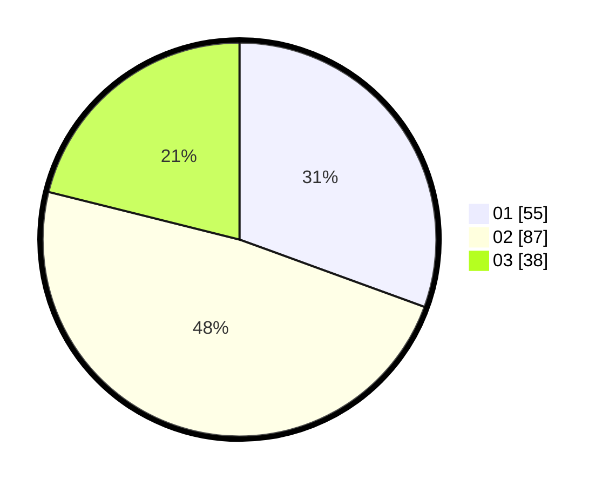

# Hasil

Hasil perolehan suara paslon dapat dilihat pada file paslon-01.txt, paslon-02.txt, dan paslon-03.txt.

Jika tidak ada, artinya data tersebut belum ada pada SIREKAP.

## Perolehan Suara

 * Paslon 01: **55**.
 * Paslon 02: **87**.
 * Paslon 03: **38**.

## Foto C Plano

https://sirekap-obj-formc.kpu.go.id/42ba/pemilu/ppwp/31/73/02/10/07/3173021007126-20240216-010421--6d5827a8-d2c2-4289-80bb-c9f0c4d3bb23.jpg

https://sirekap-obj-formc.kpu.go.id/42ba/pemilu/ppwp/31/73/02/10/07/3173021007126-20240216-010423--73d2e931-bdc0-49a4-96c5-33785e04a83f.jpg

https://sirekap-obj-formc.kpu.go.id/42ba/pemilu/ppwp/31/73/02/10/07/3173021007126-20240216-010422--f1fe30cc-14db-44e7-81aa-855c64af0198.jpg

## DATA PEMILIH TETAP

Jumlah pemilih dalam DPT: **256**.
 * L: **126**.
 * P: **130**.

## DATA PENGGUNA HAK PILIH

Jumlah pengguna hak pilih dalam DPT: **182**.
 * L: **87**.
 * P: **95**.

Jumlah pengguna hak pilih dalam DPTb: **0**.
 * L: **0**.
 * P: **0**.

Jumlah pengguna hak pilih dalam DPK: **3**.
 * L: **2**.
 * P: **1**.

Jumlah pengguna hak pilih: **185**.
 * L: **89**.
 * P: **96**.

## JUMLAH SUARA SAH DAN TIDAK SAH

JUMLAH SELURUH SUARA SAH: **180**.

JUMLAH SUARA TIDAK SAH: **5**.

JUMLAH SELURUH SUARA SAH DAN SUARA TIDAK SAH: **185**.
