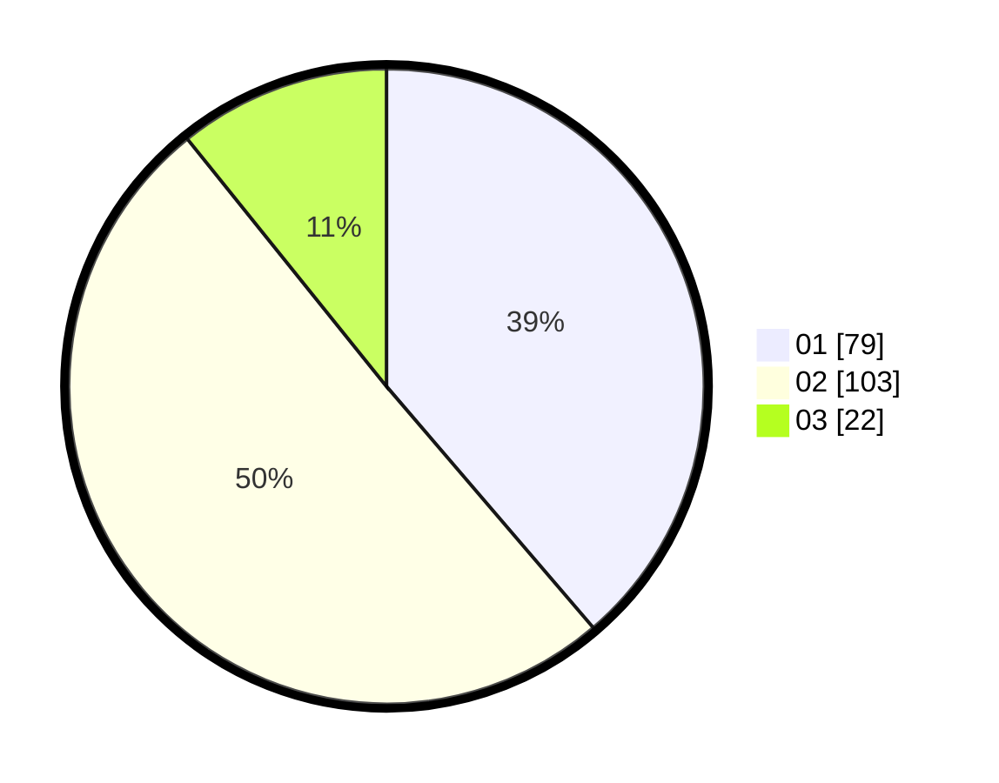

# Hasil

Hasil perolehan suara paslon dapat dilihat pada file paslon-01.txt, paslon-02.txt, dan paslon-03.txt.

Jika tidak ada, artinya data tersebut belum ada pada SIREKAP.

## Perolehan Suara

 * Paslon 01: **79**.
 * Paslon 02: **103**.
 * Paslon 03: **22**.

## Foto C Plano

https://sirekap-obj-formc.kpu.go.id/baea/pemilu/ppwp/31/73/02/10/07/3173021007133-20240214-212240--b9f1b33f-3858-443f-9296-c5a79e64ae71.jpg

https://sirekap-obj-formc.kpu.go.id/baea/pemilu/ppwp/31/73/02/10/07/3173021007133-20240214-211028--509dcee2-7271-48ed-8e37-587faa8881a4.jpg

https://sirekap-obj-formc.kpu.go.id/baea/pemilu/ppwp/31/73/02/10/07/3173021007133-20240214-212438--1fa13f1c-e81a-4683-8bb8-c4784549bdf3.jpg

## DATA PEMILIH TETAP

Jumlah pemilih dalam DPT: **280**.
 * L: **138**.
 * P: **142**.

## DATA PENGGUNA HAK PILIH

Jumlah pengguna hak pilih dalam DPT: **205**.
 * L: **102**.
 * P: **103**.

Jumlah pengguna hak pilih dalam DPTb: **0**.
 * L: **0**.
 * P: **0**.

Jumlah pengguna hak pilih dalam DPK: **0**.
 * L: **0**.
 * P: **0**.

Jumlah pengguna hak pilih: **205**.
 * L: **102**.
 * P: **103**.

## JUMLAH SUARA SAH DAN TIDAK SAH

JUMLAH SELURUH SUARA SAH: **204**.

JUMLAH SUARA TIDAK SAH: **1**.

JUMLAH SELURUH SUARA SAH DAN SUARA TIDAK SAH: **205**.
