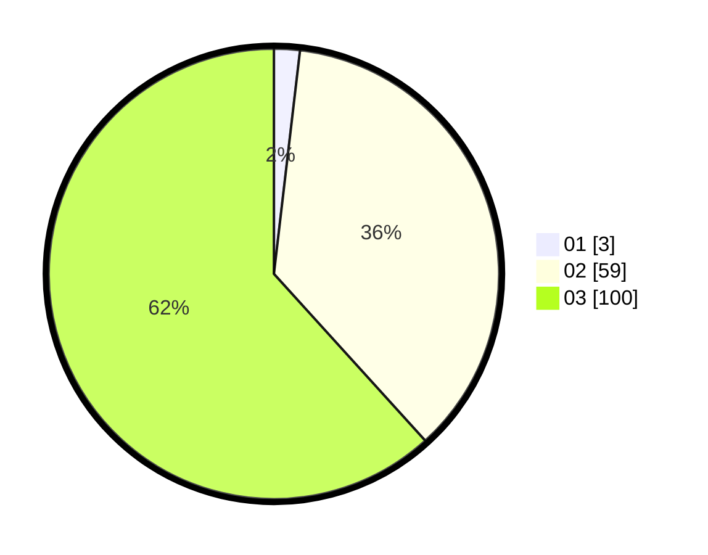

# Hasil

Hasil perolehan suara paslon dapat dilihat pada file paslon-01.txt, paslon-02.txt, dan paslon-03.txt.

Jika tidak ada, artinya data tersebut belum ada pada SIREKAP.

## Perolehan Suara

 * Paslon 01: **3**.
 * Paslon 02: **59**.
 * Paslon 03: **100**.

## Foto C Plano

https://sirekap-obj-formc.kpu.go.id/856c/pemilu/ppwp/31/73/03/10/01/3173031001001-20240214-203020--11f085df-9238-4f00-a411-5240742c7904.jpg

https://sirekap-obj-formc.kpu.go.id/856c/pemilu/ppwp/31/73/03/10/01/3173031001001-20240214-203126--dd26c184-75bf-41c0-a7a7-0f0ee831e642.jpg

https://sirekap-obj-formc.kpu.go.id/856c/pemilu/ppwp/31/73/03/10/01/3173031001001-20240214-203228--7b498b6a-8da9-4af4-946d-aaa501bebab3.jpg
