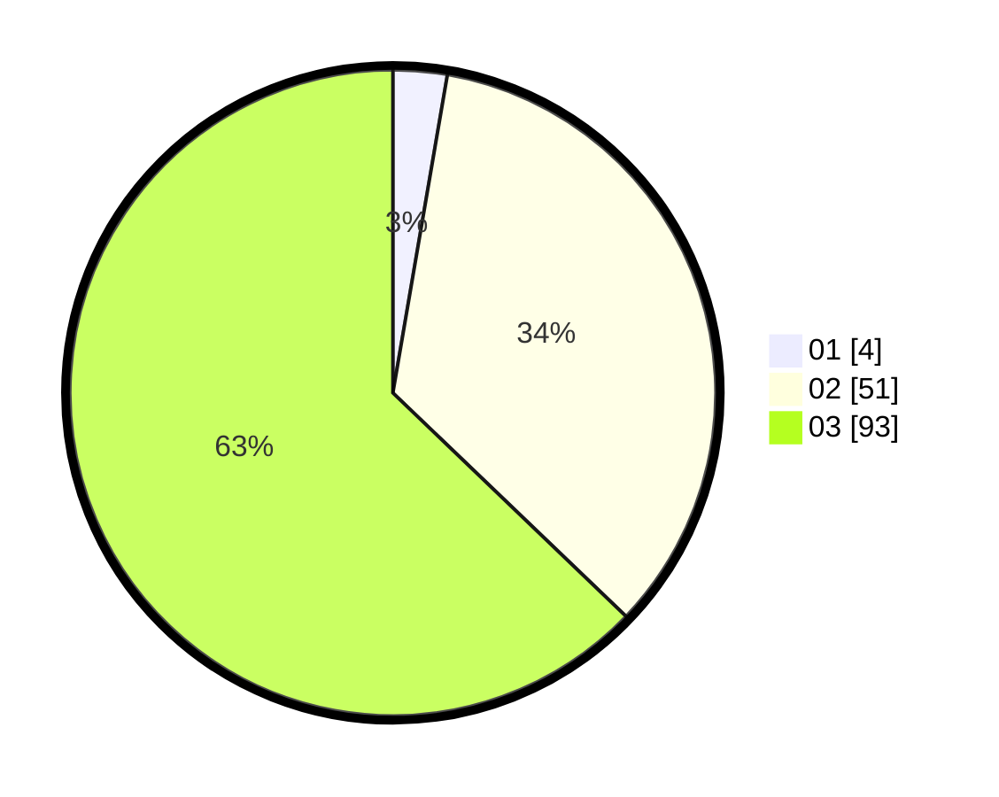

# Hasil

Hasil perolehan suara paslon dapat dilihat pada file paslon-01.txt, paslon-02.txt, dan paslon-03.txt.

Jika tidak ada, artinya data tersebut belum ada pada SIREKAP.

## Perolehan Suara

 * Paslon 01: **4**.
 * Paslon 02: **51**.
 * Paslon 03: **93**.

## Foto C Plano

https://sirekap-obj-formc.kpu.go.id/70ae/pemilu/ppwp/31/73/03/10/01/3173031001002-20240214-201243--f304dea7-249d-433a-b5e2-37902f2b7629.jpg

https://sirekap-obj-formc.kpu.go.id/70ae/pemilu/ppwp/31/73/03/10/01/3173031001002-20240216-000656--3981998f-e5f4-438b-9e9b-cc862a6db4f7.jpg

https://sirekap-obj-formc.kpu.go.id/70ae/pemilu/ppwp/31/73/03/10/01/3173031001002-20240216-003301--385ffd85-978b-4c1c-9e1d-47882fc5fb98.jpg

## DATA PEMILIH TETAP

Jumlah pemilih dalam DPT: **193**.
 * L: **89**.
 * P: **104**.

## DATA PENGGUNA HAK PILIH

Jumlah pengguna hak pilih dalam DPT: **140**.
 * L: **67**.
 * P: **73**.

Jumlah pengguna hak pilih dalam DPTb: **9**.
 * L: **5**.
 * P: **4**.

Jumlah pengguna hak pilih dalam DPK: **0**.
 * L: **0**.
 * P: **0**.

Jumlah pengguna hak pilih: **149**.
 * L: **72**.
 * P: **77**.

## JUMLAH SUARA SAH DAN TIDAK SAH

JUMLAH SELURUH SUARA SAH: **4**.

JUMLAH SUARA TIDAK SAH: **51**.

JUMLAH SELURUH SUARA SAH DAN SUARA TIDAK SAH: **93**.
